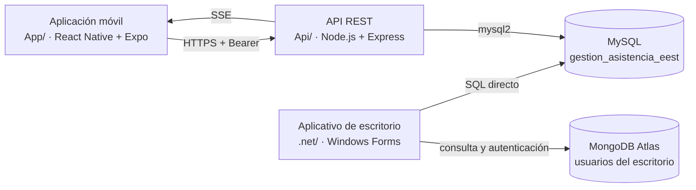

# Documentación Técnica y Análisis de Requerimientos

## Sistema Integral de Asistencia Escolar (SIA)

**Proyecto Final de Programación**
**Evaluación Anual de Capacidades Profesionales (EACP)**

| | |
|---|---|
| **Docente a cargo** | Guillermo Munafo |
| **Materia** | Proyecto de Implementación de Sitios Web Dinámicos |
| **Ciclo lectivo** | 2026 |

---

## Índice

| Sección | Título | Contenido |
|:---:|---|---|
| 1 | [Datos generales del proyecto](#s1) | Identificación del proyecto, cliente, equipo y repositorio |
| 2 | [Descripción del problema real](#s2) | Situación actual, ineficiencias y solución tecnológica propuesta |
| 3 | [Objetivos](#s3) | Objetivo general y objetivos específicos |
| 4 | [Marco teórico](#s4) | Conceptos fundamentales, justificación y criterios de selección |
| 5 | [Alcance y límites](#s5) | Funcionalidades incluidas y funcionalidades excluidas |
| 6 | [Impacto y beneficios esperados](#s6) | Impacto operativo e institucional, y factibilidad |
| 7 | [Perfiles de usuario y roles](#s7) | Perfiles, matriz de permisos y reglas de interacción |
| 8 | [Metodología de trabajo y trazabilidad](#s8) | Organización por módulos, ciclo de desarrollo y control de versiones |
| 9 | [División de módulos y responsabilidad](#s9) | Reparto de trabajo por integrante y matriz de responsabilidad |
| 10 | [Requerimientos del sistema](#s10) | Requerimientos funcionales y no funcionales por categoría |
| 11 | [Reglas de negocio](#s11) | Reglas relevadas en la institución, agrupadas por ámbito |
| 12 | [Arquitectura y tecnologías](#s12) | Módulos, bases de datos, despliegue, capas del escritorio y seguridad |
| 13 | [Plan de pruebas](#s13) | Estrategia progresiva de validación: datos ficticios, aula, curso real y carga institucional |

---

## 1. Datos generales del proyecto

### 1.1 Identificación

| Campo | Detalle |
|---|---|
| Nombre del Sistema / Proyecto | Sistema Integral de Asistencia Escolar (SIA) |
| Cliente / Organización | Escuela de Educación Secundaria Técnica N° 1 "Ara. General Belgrano" (E.E.S.T. N° 1) |
| Integrantes del grupo | Isabella Lara Carrete Vecco y Juan Ignacio Torres Troschasky |
| Materia | Proyecto de Implementación de Sitios Web Dinámicos |
| Docente a cargo | Guillermo Munafo |
| Repositorio de GitHub | <https://github.com/JuanI19T/Sistema_Asistencia> |

### 1.2 Presentación

El proyecto SIA no se limita a reemplazar un formulario en papel: **cubre el circuito completo** de la
información de asistencia, desde la carga de datos institucionales (alumnos, profesores, materias,
dictados, inscripciones) hasta el registro de asistencia en el aula y su posterior consulta. Por ello
se denomina *integral*.

El cliente es la E.E.S.T. N° 1, una institución secundaria técnica de la Provincia de Buenos Aires con
dirección, secretaria, docentes, preceptores y alumnos. El sistema se desarrolló como Evaluación Anual
de Capacidades Profesionales (EACP) de la carrera de Analista en Sistemas.

El trabajo fue realizado por dos integrantes, cada uno con su propia rama en el repositorio
(`Isa-Vecco` y `Juan-Torres`), e integrando a `main` únicamente mediante Pull Request para garantizar
la trazabilidad individual. El repositorio fue creado el **15/09/2026**.

La materia resulta pertinente porque el valor del sistema se concentra en sus componentes web: una
API REST con autenticación por token y emisión de eventos en tiempo real (SSE), consumida por una
aplicación móvil.

---

## 2. Descripción del problema real

### 2.1 Situación actual

Actualmente la Escuela de Educación Secundaria Técnica N° 1 "Ara. General Belgrano" lleva a cabo la
gestión de sus operaciones operativas y administrativas de manera **manual**, utilizando registros en
formato papel y planillas de cálculo descentralizadas.

El control diario de asistencia se realiza mayormente sobre libros y planillas físicas: cada docente
registra las presencias e inasistencias de su curso en papel y, al cierre del período, esos datos deben
transcribirse a formularios y listados administrativos. Los listados de alumnos, materias y cursadas se
mantienen en planillas de cálculo individuales, **sin una versión única compartida** entre dirección,
preceptoría y docentes.

Según el relevamiento institucional realizado con el equipo directivo (Acta del 29/04/2026), la
complejidad real es mayor que un simple listado de faltas: **las trayectorias escolares son altamente
personalizadas.** Un mismo estudiante puede cursar materias de distintos años en simultáneo, recursar
únicamente las materias que adeuda e intensificar otras, por lo que cada alumno presenta un conjunto de
cursadas diferente. Sobre esa estructura se construyen, además, las planillas de asistencia, cuyo
punto de partida es siempre el estudiante.

Con una base de datos en papel y planillas aisladas, la institución no cuenta con información
confiable, centralizada ni consultable en tiempo real para tomar decisiones sobre matrícula,
trayectorias ni regularidad.

### 2.2 Ineficiencias operativas destacables

Esta metodología genera las siguientes ineficiencias operativas:

| N° | Ineficiencia | Descripción |
|:---:|---|---|
| 1 | Riesgo de pérdida y deterioro de la información | Los registros en soporte papel pueden extraviarse, destruirse o volverse ilegibles, sin que exista copia de respaldo. |
| 2 | Información descentralizada e inconsistente | Al convivir varias planillas de cálculo sin versión única, un mismo alumno o dictado puede estar cargado de forma distinta, o duplicada, en cada archivo. |
| 3 | Dificultad para consultar el historial de asistencia | Rastrear las inasistencias de un alumno a lo largo del ciclo implica revisar planillas físicas una por una. |
| 4 | Procesos administrativos lentos | La búsqueda de un estudiante, el armado de listados y el cierre de planillas se realizan de forma manual, con demoras y trabajo repetitivo. |
| 5 | Errores humanos en la carga de datos | El paso del papel a las planillas y su posterior transcripción favorece errores de tipeo, duplicaciones y cargas incorrectas. |
| 6 | Ausencia de validaciones automáticas | El sistema actual no impide registrar una falta duplicada, cargar asistencia de un alumno no inscripto ni controlar límites de cursada, por ejemplo el máximo de intensificaciones. |
| 7 | Imposibilidad de generar reportes de forma inmediata | Cualquier métrica, como la cantidad de estudiantes con todas sus materias regularizadas o con materias pendientes, exige un conteo manual. |
| 8 | Dependencia total de la documentación física | Toda la gestión administrativa queda condicionada a la disponibilidad y al estado de las planillas en papel. |
| 9 | Ausencia de control de acceso por perfil | Las planillas no distinguen quién puede cargar, consultar o corregir datos, sin registro de qué acción realizó cada usuario. |
| 10 | Imposibilidad de operar desde el aula | El registro de asistencia solo puede efectuarse donde está la documentación física, con la clase detenida mientras el docente completa la planilla. |
| 11 | Sin visibilidad en tiempo real | Preceptoría no puede ir siguiendo la asistencia mientras la clase transcurre ni corregirla al momento. |

### 2.3 Solución tecnológica propuesta

Se propone el desarrollo del Sistema Integral de Asistencia Escolar (SIA): una solución formada por
**tres módulos interdependientes** que reemplazan el registro en papel y las planillas descentralizadas
por una única plataforma digital.

#### 2.3.1 Módulos del sistema

| N° | Módulo | Tecnología | Función |
|:---:|---|---|---|
| 1 | Aplicativo de escritorio | C# · .NET Framework · Windows Forms | Módulo administrativo para la gestión de alumnos, profesores, preceptores, especialidades, materias, dictados, inscripciones y usuarios, con control de permisos por rol y autenticación de usuarios. |
| 2 | API REST intermedia | Node.js · Express | Capa de servicios que actúa como puerta de acceso único a la base de datos, con autenticación por token (Bearer) y contraseñas cifradas con bcrypt. |
| 3 | Aplicación móvil | React Native · Expo | Módulo operativo que permite registrar la asistencia en el aula desde el celular, mediante escaneo de código QR o ingreso de un código corto generado por el docente al abrir la clase. |

#### 2.3.2 Infraestructura y reglas de negocio

El sistema se apoya sobre una infraestructura centralizada y segura:

1. **Base de datos centralizada.** Una única base MySQL (`gestion_asistencia_eest`) actúa como fuente
   única de verdad, eliminando la duplicación de planillas, con consulta de historial por alumno y
   generación de reportes en línea.
2. **Actualización en tiempo real.** La aplicación móvil actualiza la asistencia mediante eventos
   (SSE), de modo que preceptoría puede observar y corregir la asistencia mientras la clase transcurre,
   y el alumno registra su presencia en segundos sin detener la clase.
3. **Trayectorias escolares modeladas.** La estructura de cursadas personalizadas (recursado,
   intensificación, cursadas simultáneas de distintos años) queda modelada en la base, permitiendo
   cargar y consultar listados siempre desde el estudiante, conforme a la regla institucional relevada.
4. **Control de acceso por rol.** Los perfiles administrador, directivo, preceptor, profesor y alumno
   limitan la visibilidad y las acciones disponibles, y resuelven la necesidad de saber quién registró y
   corrigió cada dato.
5. **Reglas institucionales incorporadas.** El registro de clases sin docente ausente y las demás
   reglas de asistencia se incorporan como reglas de negocio del sistema.

#### 2.3.3 Cobertura del circuito completo

Con esta solución, el SIA cubre el circuito completo de la información de asistencia:

| N° | Etapa del circuito | Descripción |
|:---:|---|---|
| 1 | Carga de datos institucionales | Alta y administración de alumnos, profesores, materias, dictados e inscripciones. |
| 2 | Apertura de clase | El docente abre la clase y el sistema genera el token QR y el código corto. |
| 3 | Registro de asistencia en el aula | El alumno registra su presencia desde el dispositivo móvil. |
| 4 | Corrección por preceptoría | Preceptoría revisa y corrige los registros en tiempo real. |
| 5 | Consulta y reportes | La información se consulta por alumno y se consolidan reportes. |

El proceso que hoy se lleva a cabo en papel queda digitalizado en su totalidad.

---

## 3. Objetivos

### 3.1 Objetivo general

Desarrollar e implementar el Sistema Integral de Asistencia Escolar (SIA), una plataforma digital única
que digitalice el circuito completo del control de asistencia de la E.E.S.T. N° 1, desde la carga y
administración de los datos institucionales hasta el registro diario de asistencias en el aula y su
posterior consulta, reemplazando el registro manual en papel y las planillas de cálculo
descentralizadas por una solución centralizada, segura y operativa en tiempo real.

### 3.2 Objetivos específicos

| N° | Objetivo |
|:---:|---|
| 1 | Centralizar la información institucional en una única base de datos que actúe como fuente de verdad, eliminando la duplicación e inconsistencia de las planillas descentralizadas. |
| 2 | Digitalizar la administración institucional mediante un aplicativo de escritorio que permita el alta, baja y modificación de alumnos, profesores, preceptores, especialidades, materias, cursos, dictados e inscripciones. |
| 3 | Modelar las trayectorias escolares personalizadas de los estudiantes, permitiendo cursadas simultáneas de materias de distintos años, recursado e intensificación conforme a las reglas institucionales relevadas. |
| 4 | Garantizar la seguridad de acceso con un sistema de autenticación de usuarios y un control de permisos por rol (administrador, directivo, secretario, preceptor, profesor y alumno) que limite las acciones de cada perfil. |
| 5 | Agilizar el registro de asistencia en el aula mediante una aplicación móvil con escaneo de código QR o ingreso de código corto, de modo que el alumno registre su presencia en segundos sin interrumpir la clase. |
| 6 | Brindar visibilidad en tiempo real del estado de asistencia de una clase a través de la transmisión de eventos, permitiendo que preceptoría observe y corrija los registros mientras la clase transcurre. |
| 7 | Facilitar la consulta de información histórica, permitiendo acceder al historial de asistencia por alumno de forma inmediata, sin depender de la revisión manual de documentación física. |
| 8 | Reducir los errores de carga de datos incorporando validaciones automáticas en cada registro — asistencia de alumnos inscriptos en el dictado, apertura y estados de clase, y reglas de asistencia vigentes — que impidan cargas duplicadas o incorrectas. |
| 9 | Proteger la información sensible gestionando las credenciales de conexión fuera del código fuente y aplicando cifrado (bcrypt) sobre las contraseñas almacenadas. |
| 10 | Garantizar la extensibilidad del sistema mediante una arquitectura de servicios (API REST) separada de los clientes, que permita sumar nuevas funcionalidades en el futuro sin reescribir las aplicaciones existentes. |

---

## 4. Marco teórico

### 4.1 Conceptos fundamentales

**1. Sistema de información.** Un sistema de información es el conjunto de componentes
interrelacionados que recolectan, procesan, almacenan y distribuyen información para apoyar la toma de
decisiones y el control de una organización. En este proyecto, el sistema abandona el soporte físico de
registro (papel y planillas) y pasa a una estructura digital centralizada, en la que los datos se
capturan una sola vez, se validan al ingresar y se consultan de inmediato. El SIA se organiza, en
consecuencia, como un sistema de información integral, que cubre desde la captura de datos en el aula
hasta la gestión administrativa institucional.

**2. Base de datos y modelo Entidad-Relación (DER).** La base de datos es el repositorio centralizado
donde se persiste la información del dominio. Este proyecto emplea dos tipos de bases según su
naturaleza:

- *Base de datos relacional:* organiza los datos en tablas vinculadas mediante relaciones, garantizando
  la integridad referencial mediante claves primarias y foráneas, y se consulta con SQL. Es la base
  sobre la que se construye el modelo Entidad-Relación, en el que cada concepto real del dominio
  (alumno, profesor, preceptor, materia, especialidad, dictado, clase, asistencia, usuario) es una
  entidad con atributos y relaciones explícitas.
- *Base de datos documental:* almacena datos en documentos independientes, lo que la hace adecuada
  para perfiles de información que no responden a un esquema rígido, como los usuarios y su
  autenticación.

La necesidad de modelar trayectorias escolares personalizadas (cursadas simultáneas de materias de
distintos años, recursado, intensificación) es lo que justifica una base relacional: los vínculos de
tipo alumno-materia, alumno-dictado y alumno-asistencia exigen integridad y consultas complejas que una
planilla de cálculo no puede garantizar.

**3. Arquitectura en capas (Modelo-Vista-Controlador).** La arquitectura MVC separa la aplicación en
tres responsabilidades:

- *Modelo:* la representación de los datos y la lógica de acceso a la base de datos (entidades, DAO y
  conexión).
- *Vista:* la interfaz con la que interactúa el usuario.
- *Controlador:* la lógica que coordina y orquesta las operaciones entre ambos.

Esta separación favorece el mantenimiento, la prueba y la trazabilidad de cada módulo. El aplicativo de
escritorio implementa esta arquitectura en capas, de modo que toda futura integración con servicios
externos debe residir únicamente en el Modelo, preservando la independencia de la interfaz y de la
lógica de control.

**4. Arquitectura cliente-servidor y servicios web (API REST).** La arquitectura cliente-servidor
distribuye la aplicación entre clientes que solicitan recursos y servidores que los ofrecen. Sobre este
modelo, el proyecto incorpora una API REST, un servicio web que expone los recursos del sistema a
través de operaciones HTTP (GET, POST, PATCH), con respuestas en formato JSON.

La API actúa como puerta de acceso única a la base de datos para la aplicación móvil: los clientes
móviles nunca acceden directamente a la base, sino a través de la interfaz pública de servicios. Esto
permite que una misma lógica de negocio se comparta entre distintos clientes y que el escritorio
conserve su acceso directo sin romper el contrato de datos.

**5. Autenticación y control de acceso.** La autenticación verifica la identidad de quien intenta
ingresar al sistema; el control de acceso por roles determina qué acciones puede realizar cada usuario
luego de autenticarse. En el proyecto:

- Las contraseñas nunca se almacenan en texto plano, sino cifradas con un algoritmo de hashing
  (bcrypt), que produce un valor irreversible e incluye un factor de complejidad configurable.
- El ingreso desde la API está protegido con tokens de seguridad, credenciales temporales y firmadas que
  el cliente móvil envía en cada solicitud y que el servidor verifica, lo que permite administrar la
  sesión sin mantener estado en el servidor.

El modelo de roles del sistema (administrador, directivo, preceptor, profesor y alumno) traduce el
organigrama institucional en permisos concretos de lectura y escritura.

**6. Eventos en tiempo real (Server-Sent Events).** Los Server-Sent Events (SSE) permiten que el
servidor envíe datos al cliente de forma asíncrona y unidireccional sobre una conexión HTTP persistente.
A diferencia de la consulta periódica en la que el cliente pregunta por novedades, SSE invierte el
flujo: cuando un alumno registra su presencia, la API empuja ese cambio a los clientes suscriptos y
preceptoría ve la asistencia actualizarse en vivo, sin recargar ni volver a consultar.

**7. Código QR y captura en el aula.** El código QR es una matriz de puntos que codifica información
legible por una cámara. En el sistema, cada clase abierta por un docente genera un token QR y un código
corto alternativo; el alumno lo escanea desde su celular y su asistencia queda registrada en segundos,
eliminando la necesidad de que la clase se detenga mientras el docente completa una planilla en papel.

**8. Aplicación móvil multiplataforma.** La aplicación móvil es un cliente del sistema que se ejecuta
en teléfonos celulares. Este proyecto utiliza React Native sobre Expo, un marco que permite desarrollar
una única base de código en JavaScript/TypeScript y ejecutarla en múltiples plataformas (Android e
iOS). Expo simplifica el acceso al hardware del dispositivo (cámara, red) y acelera el ciclo de
desarrollo y prueba sobre dispositivos físicos.

**9. Conceptos de dominio: dictado, inscripción y trayectoria escolar.** Para el sistema, el dictado es
la unidad que vincula una materia con un profesor y un preceptor en un ciclo lectivo; la inscripción
asigna un alumno a ese dictado; y la trayectoria escolar describe el recorrido individual de un
estudiante a lo largo de su cursada. Como la institución no agrupa a todos los alumnos de un año bajo
una única estructura rígida, sino que cada estudiante puede cursar materias de distintos años en
simultáneo, el modelo de datos no parte del curso, sino del estudiante y sus trayectorias; la
asistencia se registra siempre en el contexto de un dictado y de una clase concreta.

### 4.2 Justificación de tecnologías

| Tecnología | Función en el proyecto | Justificación |
|---|---|---|
| C# con .NET Framework 4.7.2 | Lenguaje del aplicativo de escritorio | Maduro, tipado y con amplio soporte para aplicaciones Windows; permite construir el módulo administrativo con control total sobre la lógica de negocio y la integración con bases de datos. |
| Windows Forms + MaterialSkin.2 | Interfaz gráfica del escritorio | Framework nativo de Windows para interfaces de escritorio; MaterialSkin agrega un aspecto visual moderno y uniforme con bajo costo de desarrollo. |
| MySQL | Base de datos relacional central | Gratuito, confiable y ampliamente difundido; soporta integridad referencial, consultas SQL complejas y despliegue en la nube, condiciones necesarias para modelar dictados, inscripciones y trayectorias. |
| MongoDB Atlas | Base documental para usuarios del escritorio | Almacenamiento en la nube y flexibilidad de esquema para el perfil de usuarios y su autenticación, independiente del esquema relacional de negocio. |
| Node.js + Express 5 | API REST intermedia | Ecosistema liviano y asincrónico, ideal para servicios web de alto volumen de solicitudes concurrentes, como múltiples alumnos registrando asistencia en simultáneo. |
| mysql2 | Conector de la API con MySQL | Conexión eficiente mediante pool de conexiones, reutilizable y segura. |
| bcrypt / bcryptjs | Hash de contraseñas | Algoritmo de hash lento por diseño, que dificulta ataques de fuerza bruta; interoperable entre el escritorio y la API para validar la misma contraseña desde ambos módulos. |
| Token de sesión (Bearer) | Autenticación de la app contra la API | Permite sesiones sin estado en el servidor, portables y verificables, ideales para un cliente móvil que se reconecta. |
| Server-Sent Events | Actualización en tiempo real de la asistencia | Más simple que la comunicación bidireccional para el caso de uso (difusión de cambios de asistencia hacia los suscriptos), con reconexión automática y compatibilidad nativa HTTP. |
| React Native + Expo SDK | Aplicación móvil multiplataforma | Código único multiplataforma, desarrollo ágil sobre dispositivo físico (Expo Go) y acceso directo a la cámara para el escaneo de QR. |
| expo-camera | Escaneo de código QR | API oficial de Expo para captura de imágenes y decodificación de códigos, sin módulos nativos adicionales. |
| Entorno de variables (.env) | Gestión de credenciales | Externaliza las cadenas de conexión fuera del código fuente, evitando que secretos queden versionados en el repositorio. |
| Git y GitHub (flujo de ramas + Pull Request) | Control de versiones y trazabilidad | Registra el historial completo, permite el trabajo colaborativo en ramas individuales y audita la autoría de cada cambio antes de integrarse a la rama principal. |

### 4.3 Criterios generales de selección

Las tecnologías fueron elegidas priorizando los siguientes criterios:

1. **Costo cero.** Todas las herramientas seleccionadas son de uso gratuito, por licencia de software
   libre o ediciones comunitarias, condición relevante para un proyecto académico sin presupuesto.
2. **Compatibilidad con el ambiente institucional.** El módulo administrativo corre sobre el sistema
   operativo Windows ya presente en la institución.
3. **Complejidad adecuada al problema.** Cada tecnología resuelve una necesidad concreta detectada en
   el relevamiento, sin agregar complejidad innecesaria; por ejemplo, SSE en lugar de una comunicación
   bidireccional completa.
4. **Extensibilidad.** La separación entre escritorio, API y aplicación móvil permite sumar nuevos
   clientes o funcionalidades a futuro sin reescribir el sistema.
5. **Seguridad por diseño.** Cifrado de contraseñas, tokens de sesión, permisos por rol y credenciales
   fuera del repositorio.

---

## 5. Alcance y límites

### 5.1 Alcance

El Sistema Integral de Asistencia Escolar (SIA) comprende el desarrollo e implementación de tres módulos
que cubren el circuito completo del control de asistencia de la institución.

#### 5.1.1 Módulo de Escritorio (administración)

| N° | Funcionalidad | Descripción |
|:---:|---|---|
| 1 | Autenticación de usuarios | Ingreso con usuario y contraseña, control de sesión y creación del primer Administrador cuando no existen usuarios en el sistema. |
| 2 | Gestión de usuarios y perfiles | Alta, baja, modificación y activación o desactivación de usuarios, con contraseñas cifradas. |
| 3 | Administración de alumnos, profesores y preceptores | Alta, baja, modificación y listados. |
| 4 | Administración de especialidades y materias | Catálogo curricular con asignación de especialidad. |
| 5 | Gestión de dictados | Asignación de materia, profesor y preceptor, con sus fechas. |
| 6 | Gestión de inscripciones | Inscripción de alumnos a dictados. |
| 7 | Control de permisos por rol | El menú se filtra según el perfil del usuario: administrador, directivo, preceptor y profesor. |

#### 5.1.2 Módulo de API REST (intermediación)

| N° | Funcionalidad | Descripción |
|:---:|---|---|
| 1 | Autenticación por rol | Autenticación de preceptor, profesor y alumno mediante token de seguridad. |
| 2 | Exposición de datos | Alumnos, dictados, dictados por alumno y listados de inscriptos. |
| 3 | Gestión de clases | Apertura de clase por dictado, estados y consulta por fecha. |
| 4 | Registro de asistencias | Consulta, carga individual y carga por lote. |
| 5 | Generación y validación de tokens de clase | Emisión de código QR, escaneo y código corto de ingreso. |
| 6 | Difusión de eventos en tiempo real | Difusión de eventos hacia la aplicación móvil. |

#### 5.1.3 Módulo de Aplicación Móvil

| N° | Funcionalidad | Descripción |
|:---:|---|---|
| 1 | Login por rol | Autenticación de preceptor, profesor y alumno. |
| 2 | Perfil preceptor | Gestión de clases y seguimiento de asistencia en vivo. |
| 3 | Perfil profesor | Acceso a sus dictados, apertura de clase y generación del código QR. |
| 4 | Perfil alumno | Registro de su presencia escaneando el QR o ingresando el código curto. |

#### 5.1.4 Infraestructura

| N° | Componente | Descripción |
|:---:|---|---|
| 1 | Base de datos centralizada | MySQL (`gestion_asistencia_eest`) como única fuente de verdad, compartida por el escritorio y la API. |
| 2 | Base de datos documental | MongoDB Atlas para la autenticación de usuarios del escritorio. |
| 3 | Despliegue en la nube | Despliegue de la API y de la base de datos para su operación desde los dispositivos móviles. |

### 5.2 Límites / fuera de alcance

El sistema no contempla en esta etapa las siguientes funcionalidades:

| N° | Límite | Descripción |
|:---:|---|---|
| 1 | Gestión de calificaciones y evaluación | No se registran notas ni se maneja la promoción de materias. |
| 2 | Automatización de la trayectoria académica completa | Si bien el modelo soporta dictados e inscripciones personalizadas, la asignación automática de recursado e intensificación conforme a la regla institucional (máximo de cinco materias, priorización del recursado, límite por año) queda fuera de esta versión y se resuelve de forma asistida por el personal. |
| 3 | Módulo económico-financiero | No se gestionan pagos, cuotas ni contribuciones. |
| 4 | Gestión de legajos completos | El sistema administra los datos académicos relacionados con la asistencia, sin digitalizar documentación extraacadémica. |
| 5 | Justificación y bitácora avanzadas | La justificación de inasistencias y la bitácora de acciones figuran como proyección, no como entrega funcional completa. |
| 6 | Soporte sin conexión | El registro de asistencia requiere conexión con la API; no existe cola de carga offline. |
| 7 | Sincronización bidireccional en vivo entre escritorio y aplicación móvil | El escritorio escribe directamente en la base, por lo que sus cambios no se difunden en tiempo real a la aplicación móvil, que los ve al volver a consultar. La difusión en vivo opera solo sobre los cambios que registra la propia API. |
| 8 | Notificaciones automáticas | No se envían avisos por correo electrónico, WhatsApp ni otros canales de mensajería. |
| 9 | Versión web completa del escritorio | Las funcionalidades administrativas se ofrecen únicamente como aplicación de escritorio Windows. |
| 10 | Rol administrador en la API | El login del servicio contempla profesor, preceptor y alumno; la administración de usuarios se realiza exclusivamente desde el escritorio. |
| 11 | Copias de seguridad automáticas | La persistencia confía en la infraestructura de nube contratada, sin un esquema propio de respaldo automático. |

---

## 6. Impacto y beneficios esperados

### 6.1 Impacto operativo

La implementación del SIA transforma la operatoria diaria de la institución en los siguientes aspectos:

| N° | Aspecto | Descripción |
|:---:|---|---|
| 1 | Registro de asistencia inmediato | El alumno marca su presencia escaneando el QR o ingresando el código corto desde su celular, sin interrumpir la clase mientras el docente completa una planilla. |
| 2 | Eliminación del doble registro | Se suprime la transcripción del papel a las planillas administrativas; el dato se carga una sola vez y queda disponible para todos los módulos. |
| 3 | Reducción de tiempos administrativos | Búsquedas de estudiantes, armado de listados y cierres de planilla que antes demandaban horas de trabajo manual se resuelven con consultas inmediatas. |
| 4 | Control y corrección en tiempo real | Preceptoría observa la asistencia mientras transcurre la clase y puede corregir registros al momento, en lugar de hacerlo días después sobre el papel. |
| 5 | Disminución de errores | Las validaciones automáticas (alumno inscripto, estados de clase, reglas de asistencia) evitan cargas duplicadas o incorrectas que el registro manual no podía detectar. |
| 6 | Disponibilidad permanente de la información | Los datos centralizados en la nube pueden consultarse desde cualquier equipo autorizado, sin depender de la ubicación física de la documentación. |
| 7 | Gestión de trayectorias personalizadas | El modelo de datos acompaña la realidad institucional de cursadas simultáneas, recurso e intensificación, ordenando información que en el papel resultaba inmanejable. |

### 6.2 Impacto social e institucional

| N° | Aspecto | Descripción |
|:---:|---|---|
| 1 | Modernización de la gestión escolar | La institución avanza hacia un modelo digital de administración, alineado con las prácticas actuales de informatización de las organizaciones educativas. |
| 2 | Valorización de la información institucional | Dirección y preceptoría pasan a contar con datos confiables y actualizados para conocer la situación de matrícula, la regularidad de los estudiantes y las materias pendientes. |
| 3 | Autonomía y participación del alumno | El estudiante deja de ser un mero objeto del registro y pasa a participar activamente de su propia asistencia, lo que refuerza hábitos de responsabilidad. |
| 4 | Reconocimiento del rol docente y de preceptoría | Las tareas de control y seguimiento se elevan de un trabajo manual repetitivo a una función de supervisión y gestión apoyada en datos. |
| 5 | Fortalecimiento del vínculo con la comunidad educativa | La disponibilidad de un sistema institucional propio constituye un activo académico de la escuela, fruto del trabajo conjunto entre el equipo directivo y el equipo de desarrollo. |
| 6 | Experiencia formativa para los alumnos desarrolladores | El proyecto involucra a los integrantes del grupo en un problema real, con usuarios reales y requisitos relevados, fortaleciendo sus capacidades profesionales. |

### 6.3 Factibilidad

El proyecto se considera factible desde sus tres dimensiones:

| Dimensión | Evaluación |
|---|---|
| Factibilidad técnica | Las tecnologías seleccionadas (C#/.NET, MySQL, Node.js/Express, React Native/Expo) son de acceso libre, maduras y de amplia documentación. El equipo ya cuenta con un prototipo funcional operativo: los tres módulos desarrollados, la base de datos restaurable mediante script y el despliegue en la nube funcionando, lo que confirma la viabilidad técnica de la solución. |
| Factibilidad operativa | La institución ya posee la estructura, el equipamiento (computadoras Windows y teléfonos inteligentes) y el personal con experiencia en el procedimiento de toma de asistencia. El sistema fue diseñado a partir del relevamiento directo con el equipo directivo, por lo que contempla las reglas y la metodología de trabajo reales de la escuela. La capacitación requerida para los usuarios es mínima, dado que las interfaces simplifican tareas que el personal ya realiza. |
| Factibilidad económica | Al tratarse de un proyecto académico, no existe costo de mano de obra de desarrollo. Todas las herramientas y plataformas utilizadas son gratuitas (ediciones comunitarias o de código abierto). El equipamiento ya existe en la institución y el costo futuro se limita al mantenimiento correctivo y evolutivo, estimado como bajo, y a la eventual contratación de los servicios en la nube ya utilizados en la etapa de desarrollo. |

---

## 7. Perfiles de usuario y roles

El sistema distingue seis perfiles de usuario, cada uno con un alcance propio de visibilidad y de
acciones. Todos los usuarios y sus datos se almacenan en una base de datos no relacional (MongoDB), y
es esa estructura la que respalda la gestión de identidades, perfiles y sesiones del sistema.

### 7.1 Perfiles del sistema

| Rol | Descripción | Alcance general |
|---|---|---|
| Administrador | Responsable de la configuración global del sistema. | Acceso total: gestión de usuarios, perfiles, configuración y mantenimiento. |
| Directivo | Conducción institucional. | Acceso amplio: administra personal y realiza la mayor parte de las funciones del sistema. |
| Secretario | Soporte administrativo. | Carga y modifica datos de profesores, preceptores y alumnos; sin acceso a directivos ni a otros secretarios. |
| Preceptor | Seguimiento cotidiano de los cursos. | Ve datos de alumnos y profesores; crea clases y modifica determinada información, con limitaciones. |
| Profesor | Dictado de las materias. | Ve únicamente los alumnos inscriptos a sus clases y los datos de esas clases; no modifica datos. |
| Alumno | Participante de las clases. | Ve solo sus datos personales y la información de las clases a las que asiste; no modifica datos. |

### 7.2 Descripción de los roles

#### Administrador

Cuenta con acceso a todo. Administra los usuarios y perfiles del sistema, la configuración general y el
mantenimiento de la plataforma. Es el único rol, junto con el directivo, habilitado para modificar la
información personal de cualquier usuario.

#### Directivo

Posee acceso a casi todas las funciones del sistema. Su rol se centra en la conducción institucional:

- **Carga del personal:** registra y da de alta a profesores, secretarios, preceptores y alumnos.
- **Modificación de datos:** actualiza la información de los perfiles que dependen de su gestión,
  incluida la información personal, junto con el administrador.

#### Secretario

Cumple funciones administrativas de soporte:

- Puede cargar y modificar datos de profesores, preceptores y alumnos.
- No puede modificar los datos de los directivos ni los de otros secretarios.

#### Preceptor

Rol operativo de seguimiento cotidiano:

- Ve la información de los alumnos y de los profesores.
- Interactúa con los profesores para asignarles cursos, sin poder modificar sus datos.
- Con los alumnos sí puede modificar datos y realizar acciones de gestión: inscribirlos en clases y
  registrar su asistencia.
- Puede crear clases y modificar cierta información, siempre dentro de un alcance limitado según la
  complejidad de la operación.

#### Profesor

Rol de dictado de clases:

- Ve únicamente los alumnos inscriptos a sus clases y los datos de esas clases: dictados, fechas y
  estado.
- Ve además la información de los preceptores y alumnos con los que interactúa.
- No puede modificar nada del sistema.

#### Alumno

Rol de participación:

- Ve solamente sus datos personales y la información de las clases a las que asiste.
- Puede ver la información de los profesores y preceptores relacionados con sus clases.
- No puede modificar nada del sistema.

### 7.3 Matriz de permisos por rol

| Acción | Administrador | Directivo | Secretario | Preceptor | Profesor | Alumno |
|---|:---:|:---:|:---:|:---:|:---:|:---:|
| Acceso total al sistema | X | - | - | - | - | - |
| Cargar personal | X | X | P | - | - | - |
| Modificar datos de usuarios | X | X | P | P | - | - |
| Modificar información personal de cualquier usuario | X | X | - | - | - | - |
| Ver alumnos inscriptos a un curso o clase | X | X | X | X | X | - |
| Ver datos de profesores | X | X | X | X | X | S |
| Ver datos de alumnos | X | X | X | X | - | - |
| Inscribir alumnos a clases | X | X | X | X | - | - |
| Crear clases | X | X | X | X | - | - |
| Registrar asistencia | X | X | X | X | - | - |
| Ver datos de preceptores involucrados | X | X | X | X | X | S |
| Ver y consultar su historial de asistencia | X | X | X | X | - | R |
| Modificar sus propios datos | - | - | - | - | - | - |

| Símbolo | Significado |
|:---:|---|
| X | La acción está disponible. |
| P | La acción es parcial. |
| S | Solo puede consultar datos relacionados con sus acciones en el sistema. |
| R | Solo puede acceder a acciones relacionadas con sus datos. |

### 7.4 Reglas de gestión de la información personal

La información personal de cada usuario no puede ser modificada por el propio usuario, cualquiera sea su
rol. Ese tipo de modificación queda reservada exclusivamente a los roles de Directivo y Administrador.

Los demás roles (secretario y preceptor) pueden operar sobre los datos académicos y operativos
(inscripciones, asistencia, asignación de cursos) dentro de los límites de su perfil, pero no sobre la
información personal de identidad de los usuarios.

### 7.5 Resumen de la interacción entre roles

| Quién | Con quién | Qué puede hacer |
|---|---|---|
| Directivo | Profesores, secretarios, preceptores y alumnos | Cargarlos, modificarlos y gestionar sus datos. |
| Secretario | Profesores, preceptores y alumnos | Cargarlos y modificar sus datos, sin directivos ni otros secretarios. |
| Preceptor | Profesores | Ver su información e interactuar para asignarles cursos, sin modificar sus datos. |
| Preceptor | Alumnos | Modificar sus datos, inscribirlos en clases y registrarles asistencia. |
| Profesor | Alumnos y preceptores | Solo visualización de la información de quienes interactúan con su cursada. |
| Alumno | Profesores y preceptores | Solo visualización de la información relacionada con sus clases. |

---

## 8. Metodología de trabajo y trazabilidad

### 8.1 Metodología de desarrollo

#### 8.1.1 Organización del trabajo por módulos

El proyecto se desarrolló dividiendo el sistema en tres partes interdependientes, cuyo orden responde a
una lógica de dependencia de datos:

| N° | Módulo | Descripción |
|:---:|---|---|
| 1 | Aplicativo de escritorio | Módulo administrativo donde se cargan y administran los datos institucionales (alumnos, profesores, preceptores, materias, dictados, inscripciones y usuarios). Constituye la primera etapa del desarrollo, ya que debía quedar bastante avanzado para poder continuar con el resto de los módulos: toda la información que estos consumen se ingresa a la base de datos a través de él. |
| 2 | Aplicación móvil | Módulo operativo de registro de asistencia, desarrollado en React Native. |
| 3 | Página o aplicación web | Módulo complementario, también desarrollado en React Native, que comparte con la aplicación móvil la dependencia de los datos cargados desde el escritorio. |

La aplicación móvil y la web dependen de los datos que se ingresan a la base de datos mediante el
aplicativo de escritorio: no existen por fuera de la información institucional registrada en el módulo
administrativo. Esta relación determinó el orden de construcción y definió que el escritorio fuera el
primer entregable funcional de la solución.

#### 8.1.2 Evolución de la gestión del trabajo

El proceso de desarrollo atravesó dos etapas de organización bien diferenciadas:

| Etapa | Descripción |
|---|---|
| 1. Gestión previa a GitHub (Drive y canal de comunicación Discord) | En un inicio, el equipo trabajó con la información del proyecto distribuida en carpetas compartidas de Google Drive, y el archivo del aplicativo de escritorio se compartía enviándolo por un canal de Discord dedicado al proyecto o por WhatsApp. Esta modalidad presentó un problema operativo recurrente: el archivo solía corromperse con frecuencia, lo que obligaba a reconstruir versiones, dificultaba saber cuál era la copia vigente y ponía en riesgo la continuidad del trabajo realizado. |
| 2. Migración a GitHub | Ante esas limitaciones, el equipo creó el repositorio de GitHub del proyecto. En su creación, uno de los integrantes se encargó de subir todo el material desarrollado hasta ese momento, consolidando el avance existente y estableciendo el punto de partida desde el cual continuar el desarrollo. A partir de esa migración, la información dejó de dispersarse entre Drive, Discord y WhatsApp, y pasó a convivir en un único repositorio con historial y control de versiones. |

#### 8.1.3 Ciclo de desarrollo

El ciclo adoptado combina planificación por etapas y desarrollo incremental:

1. **Relevamiento:** identificación de las necesidades institucionales junto al equipo directivo.
2. **Análisis y diseño:** definición de requerimientos, reglas de negocio y modelo de datos.
3. **Construcción por módulos:** desarrollo secuencial del escritorio primero y de la app y la web
   después, sobre los datos que aquel administra.
4. **Pruebas:** verificación funcional de cada módulo antes de integrarlo.
5. **Integración y revisiones:** protocolo de incorporación de cambios descrito en la sección 8.2.

### 8.2 Traceabilidad y GitHub

#### 8.2.1 Control de versiones

El repositorio de GitHub constituye el instrumento formal de trazabilidad del proyecto: conserva el
historial de cada cambio, acredita la autoría individual del trabajo y permite reconstruir el estado del
sistema en cualquier momento.

A la fecha del informe, el repositorio contiene más de 25 commits, la documentación del proyecto, el
script de definición de la base de datos y el código fuente de los módulos desarrollados.

#### 8.2.2 Flujo de trabajo con ramas

El equipo adoptó una estrategia de trabajo basada en ramas (branches):

| Elemento | Descripción |
|---|---|
| Rama principal (main) | Integra la versión estable del proyecto. No recibe commits directos. |
| Rama individual por integrante | Cada desarrollador trabaja en su propia rama asignada, con autonomía para avanzar sobre los módulos bajo su responsabilidad. |
| Integración mediante Pull Request | Cuando un integrante completa un cambio, pushea su rama y solicita su incorporación a la rama principal mediante un Pull Request. Este paso permite revisar la modificación antes de integrarla y registra formalmente qué trabajo aportó cada uno. |

Este flujo garantiza que:

- Cada integrante pueda desarrollar en paralelo sin pisar el trabajo del otro.
- Ningún cambio ingresado a la rama principal esté sin revisión.
- La autoría de cada funcionalidad sea auditable, dejando constancia de quién realizó cada cambio y
  cuándo.

#### 8.2.3 Conservación y seguridad del repositorio

Para proteger la continuidad del trabajo se definieron reglas que el equipo respeta en cada operación:

- **Los secretos no se versionan:** las credenciales de conexión se mantienen fuera del repositorio, en
  archivos de entorno ignorados, protegiendo la seguridad del sistema.
- **Prohibidos los borrados destructivos:** operaciones como el descarte forzado del historial o la
  limpieza de archivos sin confirmar están fuera de uso, para garantizar que ninguna acción accidental
  implique pérdida de datos.
- **Los archivos generados no se suben:** dependencias y artefactos de compilación permanecen fuera del
  control de versiones, manteniendo el repositorio liviano y confiable.

---

## 9. División de módulos y responsabilidad

Para garantizar la trazabilidad del trabajo individual y aprovechar las fortalezas de cada integrante,
las funcionalidades del sistema se dividieron atendiendo al ámbito en el que mejor se desempeña cada
uno. Este fue un criterio deliberado del equipo: en este proyecto, cada integrante se encarga de lo que
mejor le sale.

### 9.1 Alumno 1: Isabella Lara Carrete Vecco

#### 9.1.1 Módulo de Diseño y Experiencia de Usuario

- Diseño de la interfaz de usuario de los distintos módulos del sistema.
- Diseño funcional de los módulos y de la forma en que el usuario interactúa con ellos.
- Participación en el diseño del aplicativo de escritorio, cuya decodificación completa corrió por cuenta
  de Juan.
- Diseño, desarrollo y distribución de la aplicación web y de la aplicación móvil, incluyendo el diseño
  de las interfaces de ambas aplicaciones.

**Aclaración sobre la migración tecnológica.** Las aplicaciones web y móvil se decidieron desarrollar
recientemente con React Native, lo que implicó migrar el trabajo previamente realizado con Flutter para
la aplicación móvil y con PHP y HTML para la aplicación web. La migración y el diseño de las nuevas
interfaces están a cargo de Isabella, con la colaboración inicial de Juan.

#### 9.1.2 Módulo de Extensibilidad del proyecto

- Busca y diagrama posibles mejoras del sistema y vela por que el proyecto pueda extenderse en el
  futuro.
- Realiza diagramas de bases de datos de ejemplo para que, si el proyecto continúa el año que viene
  con otro grupo, sus integrantes sepan cómo retomarlo y cómo abordar sus extensiones.

Entre los diagramas contemplados se encuentran:

| N° | Extensión propuesta | Objetivo |
|:---:|---|---|
| 1 | Registro completo de legajos | Incorporar todos los documentos de los alumnos (libreta de vacunas, copia del DNI, datos de obra social, fichas de inscripción, etc.), para evitar que se pierdan ciertos documentos y facilitar su localización. |
| 2 | Gestor de notas | Digitalizar las notas de los finales de cada alumno, eliminando el riesgo de que se confundan o se pierdan y posibilitando la generación de un boletín digital con acceso más sencillo. |

#### 9.1.3 Módulo de Documentación

- Se encarga de toda la documentación del proyecto, incluyendo el presente informe y los documentos
  técnicos y funcionales que acompañan al desarrollo.

### 9.2 Alumno 2: Juan Ignacio Torres Troschasky

#### 9.2.1 Módulo de Aplicativo de Escritorio

- Creación del aplicativo de escritorio casi en su totalidad, incluida la mayor parte de su
  programación, dado que es el ámbito que mejor maneja.
- Isabella intervino en el diseño del módulo; la implementación del código es responsabilidad de Juan.

#### 9.2.2 Módulo de Conexiones QR (en desarrollo)

- Implementación de la utilidad de conexiones con código QR en la aplicación móvil para la toma de
  asistencia. Se encuentra actualmente en etapa de pruebas: se analiza y verifica cuál es la mejor forma
  de realizarlo antes de su integración definitiva.

#### 9.2.3 Módulo de Colaboración en Migración y Soporte técnico

- Colaboración inicial en la migración de la aplicación de Flutter y de PHP y HTML hacia React Native,
  ayudando a impulsar el inicio del diseño del funcionamiento de la API de comunicación con la base de
  datos.
- Búsqueda de distintos frameworks adicionales que puedan ayudar en el proceso de hacer que las
  interfaces sean más agradables y funcionales.

### 9.3 Trabajo conjunto

Las etapas anteriores al desarrollo modular fueron realizadas en conjunto por ambos integrantes:

- Investigación previa del proyecto.
- Diseño de la base de datos: estudio de factibilidad, modelo Entidad-Relación (MER) y diagrama
  entidad-relación del sistema.
- Búsqueda y selección de las tecnologías utilizadas actualmente en el proyecto.

### 9.4 Nota sobre las tecnologías adoptadas

Parte de las tecnologías en uso fueron incorporadas por la recomendación de compañeros que las emplean
en sus propios proyectos. Al conocer su utilidad a través de esas experiencias, el equipo decidió
adoptarlas. Es el caso, por ejemplo, del host de base de datos en Railway, utilizado para el despliegue
de la base de datos y de la API del sistema.

### 9.5 Matriz de responsabilidad

| Responsabilidad | Isabella | Juan |
|---|---|---|
| Diseño de interfaces y experiencia de usuario | X | - |
| Diseño funcional de módulos | X | Consulta |
| Aplicativo de escritorio (desarrollo completo) | - | X |
| Aplicación web (React Native) | X | - |
| Aplicación móvil (React Native) | Diseñó y desarrolló | QR en pruebas |
| Migración (Flutter y PHP con HTML hacia React Native) | General | Inicio y API |
| Diseño de la API de comunicación con la base de datos | Consulta | X |
| Búsqueda de frameworks para las interfaces | - | X |
| Extensibilidad: diagramas de futuras extensiones | X | - |
| Documentación completa del proyecto | X | - |
| Investigación, base de datos y selección de tecnologías | X | X |

---

## 10. Requerimientos del sistema

### 10.1 Requerimientos funcionales (RF)

| Código | Requerimiento |
|:---:|---|
| RF-01 | El sistema debe permitir la autenticación de usuarios mediante usuario y contraseña, con contraseñas almacenadas de forma cifrada (bcrypt). |
| RF-02 | El sistema debe permitir la creación del primer Administrador cuando no exista ningún usuario cargado. |
| RF-03 | El sistema debe gestionar usuarios y perfiles con alta, baja, modificación y activación o desactivación. |
| RF-04 | El sistema debe administrar alumnos con alta, baja y modificación de sus datos. |
| RF-05 | El sistema debe administrar profesores con alta, baja y modificación de sus datos. |
| RF-06 | El sistema debe administrar preceptores con alta, baja y modificación de sus datos. |
| RF-07 | El sistema debe administrar especialidades y materias, asociando cada materia a una especialidad. |
| RF-08 | El sistema debe gestionar dictados, vinculando materia, profesor y preceptor. |
| RF-09 | El sistema debe permitir la inscripción de alumnos a dictados. |
| RF-10 | El sistema debe aplicar control de acceso por rol, filtrando menús y acciones según el perfil (administrador, directivo, secretario, preceptor, profesor y alumno). |
| RF-11 | El docente debe poder abrir una clase desde su dictado, generando un token QR y un código corto de ingreso. |
| RF-12 | El alumno debe poder registrar su asistencia escaneando el QR o ingresando el código corto desde la aplicación móvil. |
| RF-13 | El sistema debe permitir registrar asistencias de forma individual y por lote, validando que el alumno pertenezca al dictado. |
| RF-14 | El sistema debe permitir consultar la asistencia de una clase, de un dictado y el historial por alumno. |
| RF-15 | El sistema debe actualizar la asistencia en tiempo real hacia los clientes conectados (eventos SSE), para que preceptoría siga y corrija la asistencia en vivo. |
| RF-16 | El sistema debe gestionar los estados de las clases: apertura, cierre y consulta por fecha. |
| RF-17 | La API debe exponer un endpoint de verificación de salud (`/api/health`) que confirme que el servidor responde. |
| RF-18 | El sistema debe implementar baja lógica de entidades, conservando el registro activo cuando corresponda. |
| RF-19 | El sistema debe exponer los datos a la aplicación móvil exclusivamente a través de la API, con autenticación por token. |
| RF-20 | Las credenciales de conexión deben leerse de archivos de entorno no versionados y no estar hardcodeadas en el código. |
| RF-21 | El sistema debe registrar errores en archivos de log para el diagnóstico de fallas de arranque y ejecución. |

### 10.2 Requerimientos no funcionales (RNF)

#### 10.2.1 Seguridad

| Código | Requerimiento |
|:---:|---|
| RNF-01 | Las contraseñas deben almacenarse cifradas con bcrypt y verificarse de forma interoperable entre el escritorio y la API. |
| RNF-02 | El acceso desde la API debe proteger las solicitudes con tokens de sesión (Bearer) firmados, que caducan y se invalidan si la clave de firma cambia. |
| RNF-03 | Ninguna credencial real (cadenas de conexión, claves) debe quedar versionada en el repositorio; los archivos de entorno solo contienen placeholders. |
| RNF-04 | El sistema debe restringir las acciones de cada usuario conforme a su rol, evitando el acceso a módulos no autorizados. |

#### 10.2.2 Disponibilidad y confiabilidad

| Código | Requerimiento |
|:---:|---|
| RNF-05 | La base de datos debe estar disponible de forma permanente para garantizar el registro y la consulta de asistencias, hosting en la nube. |
| RNF-06 | La aplicación móvil debe poder reconectarse automáticamente ante pérdidas de conexión con la API. |
| RNF-07 | El sistema debe preservar la integridad de los datos, no permitiendo combinaciones inválidas, como la asistencia de alumnos no inscriptos. |

#### 10.2.3 Rendimiento

| Código | Requerimiento |
|:---:|---|
| RNF-08 | El registro de asistencia debe completarse en segundos, permitiendo que el alumno marque presencia sin interrumpir el desarrollo de la clase. |
| RNF-09 | La API debe soportar la carga concurrente de múltiples alumnos registrando asistencia en simultáneo, mediante un pool de conexiones. |
| RNF-10 | La difusión en tiempo real (SSE) debe reflejar los cambios de asistencia a los suscriptores sin latencia perceptible. |

#### 10.2.4 Usabilidad

| Código | Requerimiento |
|:---:|---|
| RNF-11 | Las interfaces deben ser simples e intuitivas para usuarios sin formación técnica: docentes, preceptores y alumnos. |
| RNF-12 | El diseño visual debe ser uniforme en todas las pantallas del escritorio. |
| RNF-13 | El flujo de toma de asistencia en el aula debe requerir la mínima cantidad de pasos posible. |

#### 10.2.5 Compatibilidad y portabilidad

| Código | Requerimiento |
|:---:|---|
| RNF-14 | El aplicativo de escritorio debe funcionar sobre Windows 10 o superior. |
| RNF-15 | La aplicación móvil debe ejecutarse en Android e iOS a partir de una única base de código. |
| RNF-16 | La configuración (host, puertos, claves) debe residir en archivos de entorno, permitiendo cambiar de un entorno local a producción sin modificar el código. |
| RNF-17 | Los nombres de tablas deben ir en minúscula para garantizar compatibilidad con el servidor de base de datos en Linux (Railway). |

#### 10.2.6 Mantenibilidad y extensibilidad

| Código | Requerimiento |
|:---:|---|
| RNF-18 | El escritorio debe implementar arquitectura en capas tipo MVC, de modo que toda futura integración solo se agregue en la capa de Modelo. |
| RNF-19 | El sistema debe separar escritorio, API y aplicación móvil como módulos independientes, permitiendo ampliar funcionalidades sin reescribir las aplicaciones existentes. |
| RNF-20 | El código y la documentación deben seguir convenciones claras: identificadores y base de datos en español, rutas y JSON de la API sin acentos. |
| RNF-21 | El proyecto debe conservar documentación técnica y un historial de versiones completo que permita reconstruir el estado del sistema en cualquier momento. |

#### 10.2.7 Trazabilidad

| Código | Requerimiento |
|:---:|---|
| RNF-22 | Todo cambio debe registrarse en el control de versiones y llegar a la rama principal mediante revisión, de modo que quede constancia de la autoría de cada funcionalidad. |

---

## 11. Reglas de negocio (RN)

Las reglas de negocio del sistema fueron extraídas del relevamiento institucional realizado con el
equipo directivo (Acta del 29/04/2026) y complementadas con las validaciones derivadas del estudio de
factibilidad y del comportamiento definido para el sistema.

### 11.1 Modalidades de cursada

| Código | Regla |
|:---:|---|
| RN-01 | En la institución no existe la figura de estudiante oyente: todo estudiante que participa de una clase está registrado formalmente. |
| RN-02 | Un estudiante puede cursar una materia por primera vez o como recursante, de todas las materias pendientes o únicamente de algunas. |
| RN-03 | La institución no utiliza el concepto de repetir el año; en su lugar, el estudiante vuelve a cursar determinadas materias que mantiene pendientes. |
| RN-04 | Un estudiante no pasa de curso: comienza a cursar las materias del año siguiente conservando las que aún tiene sin aprobar. |
| RN-05 | Un estudiante puede encontrarse cursando simultáneamente materias de distintos años curriculares. Por ejemplo, un estudiante ubicado administrativamente en 4.º año cursa dos materias de 4.º y cinco pendientes de 3.º. |
| RN-06 | El sistema parte siempre del estudiante y su trayectoria para generar planillas de asistencia y listados; no organiza la información con el curso como único eje. |

### 11.2 Intensificación

| Código | Regla |
|:---:|---|
| RN-07 | La institución implementa períodos de intensificación distribuidos a lo largo del ciclo lectivo: marzo, julio, última semana de noviembre, diciembre y febrero. |
| RN-08 | Un estudiante puede intensificar hasta un máximo de cinco (5) materias. |
| RN-09 | Si un estudiante supera el máximo de cinco materias, las materias excedentes deben recursarse. |
| RN-10 | Los estudiantes que intensifican pueden pertenecer tanto al curso habitual del docente como a otros cursos; el docente administra a todos ellos. |
| RN-11 | La definición de qué materias intensificar depende de la trayectoria académica del estudiante. |
| RN-12 | La lógica general de la trayectoria académica es: cursada regular, luego intensificación, luego nueva intensificación si corresponde, y finalmente recursado. |

### 11.3 Asignación de materias y cursos

| Código | Regla |
|:---:|---|
| RN-13 | El estudiante no elige libremente las materias que cursará: la asignación la determina la institución según su trayectoria académica. |
| RN-14 | La asignación de materias considera la disponibilidad horaria del estudiante. |
| RN-15 | Siempre que sea posible se prioriza el recursado; cuando el recursado no resulta viable, el estudiante intensifica la materia correspondiente. |
| RN-16 | Un estudiante no puede cursar un número de materias superior al máximo permitido para su año, contemplando tanto las cursadas regulares como las recursadas. |
| RN-17 | El proceso de asignación de un estudiante a un curso consta de tres pasos: determinar qué materias debe cursar, asignarlo al grupo correspondiente de cada materia y definir el aula donde desarrollará la cursada. |
| RN-18 | La asignación de materias debe respetar la compatibilidad horaria entre todas las materias del estudiante. |
| RN-19 | La institución no organiza inicialmente la cursada en función del docente: primero se define la trayectoria del estudiante y luego se resuelve la asignación docente. |

### 11.4 Asistencia

| Código | Regla |
|:---:|---|
| RN-20 | Cuando un docente se encuentra ausente, el estudiante no registra inasistencia en esa materia. |
| RN-21 | La clase con docente ausente continúa contabilizándose dentro del total de clases previstas para la materia. |
| RN-22 | La asistencia solo puede registrarse sobre alumnos inscriptos en el dictado correspondiente. |
| RN-23 | El registro de presencia de un alumno en una clase se realiza mediante escaneo del código QR o ingreso del código corto generado al abrir la clase. |
| RN-24 | El seguimiento y la corrección de la asistencia corresponden a preceptoría, pudiendo observar el estado en tiempo real mientras la clase transcurre. |

### 11.5 Materias en riesgo

| Código | Regla |
|:---:|---|
| RN-25 | La determinación de una materia en riesgo contempla dos criterios: el criterio pedagógico y el criterio administrativo. |
| RN-26 | La evaluación de una materia en riesgo se realiza durante el proceso de calificación. |
| RN-27 | Cuando la problemática involucra el desempeño de un docente, el seguimiento corresponde al área de preceptoría. |

### 11.6 Gestión de usuarios y datos

| Código | Regla |
|:---:|---|
| RN-28 | La información personal de cada usuario no puede ser modificada por el propio usuario, cualquiera sea su rol; solo un directivo o administrador puede modificar ese tipo de datos. |
| RN-29 | Los secretarios pueden cargar y modificar datos de profesores, preceptores y alumnos, pero no los de directivos ni los de otros secretarios. |
| RN-30 | Los preceptores pueden modificar datos de alumnos e inscribirlos en clases, pero no pueden modificar los datos de los profesores: solo interactúan con ellos para asignarles cursos. |
| RN-31 | Los profesores y los alumnos solo pueden consultar los datos habilitados para su perfil, sin modificar información del sistema. |
| RN-32 | Cada usuario accede exclusivamente a los módulos correspondientes a su rol, sin posibilidad de operar sobre funciones de otros perfiles. |
| RN-33 | El alta de una entidad nueva se produce siempre con estado activo, y las bajas se realizan de forma lógica, preservando el historial del registro. |
| RN-34 | Las credenciales de acceso y las cadenas de conexión no deben exponerse en el código ni versionarse en el repositorio. |

---

## 12. Arquitectura y tecnologías utilizadas

### 12.1 Arquitectura general del sistema

El Sistema Integral de Asistencia Escolar (SIA) adopta una arquitectura de tres módulos
interdependientes que comparten una única fuente de datos:

- **Aplicativo de escritorio:** módulo administrativo que escribe directamente sobre la base MySQL y
  autentica sus usuarios contra MongoDB.
- **API REST:** puerta de acceso única a la base para la aplicación móvil, con endpoints y difusión de
  eventos en tiempo real (SSE).
- **Aplicación móvil:** cliente que habla únicamente con la API, nunca con la base de datos.

| Módulo | Carpeta | Stack tecnológico | Rol |
|---|:---:|---|---|
| Aplicativo de escritorio | `.net/` | C# / .NET Framework 4.7.2, Windows Forms, MaterialSkin.2 | Gestión institucional y administrativa |
| API REST | `Api/` | Node.js, Express 5, mysql2, bcryptjs | Servicios de datos, autenticación y eventos |
| Aplicación móvil | `App/` | React Native, Expo SDK, expo-camera | Registro de asistencia en el aula con QR |

La dependencia queda acotada en un solo sentido: la aplicación móvil nunca accede a la base de datos
de forma directa, y la API nunca se expone a los formularios del escritorio. Así, el acceso a los
datos tiene siempre un único punto de entrada por módulo.

### 12.2 Bases de datos

- **MySQL (`gestion_asistencia_eest`):** base relacional que actúa como única fuente de verdad
  compartida. Modela las entidades de negocio: `especialidad`, `materia`, `profesor`, `preceptor`,
  `alumno`, `dictado`, `inscribe`, `clase`, `asistencia` y `usuario`.
- **MongoDB Atlas:** base documental, no relacional, utilizada para el almacenamiento de los usuarios
  del aplicativo de escritorio y su autenticación.

### 12.3 Despliegue en la nube

- **Railway:** aloja la API y la base MySQL en producción, garantizando disponibilidad permanente y
  acceso desde los dispositivos móviles.
- **MongoDB Atlas:** aloja la base documental de usuarios.

### 12.4 Arquitectura del aplicativo de escritorio (Vista > Controlador > Modelo)

El escritorio implementa una arquitectura en capas tipo MVC, donde cada capa tiene una
responsabilidad exclusiva:

| Capa | Ejemplos de contenido | Responsabilidad |
|---|---|---|
| Vista | `FrmLogin`, `FrmPrincipal`, `FrmAlumnos`, `FrmProfesores` | Interfaz de usuario: carga de datos y presentación de resultados |
| Controlador | Un controlador por módulo | Lógica de coordinación: recibe las acciones de la vista y orquesta las operaciones del modelo |
| Modelo | `Entidades/`, `DAO/`, `Conexion/` | Datos y persistencia: entidades, acceso a datos (DAO) y conexiones |
| Utilidades | `Sesion`, `Logger`, `Ejecutor`, `DatosException` | Servicios transversales: usuario en memoria, registro de errores, validaciones y utilidades de interfaz |

Dentro del modelo:

- **Entidades:** `Alumno`, `Profesor`, `Preceptor`, `Materia`, `Especialidad`, `Dictado`,
  `Inscripcion`, `Asistencia`, `Usuario` y `Rol`.
- **DAO (Data Access Objects):** un DAO por tabla para MySQL (`AlumnoDAO`, `ProfesorDAO`,
  `PreceptorDAO`, `MateriaDAO`, `EspecialidadDAO`, `DictadoDAO`, `InscripcionDAO`) y un `UsuarioDAO`
  para MongoDB.
- **Conexión:** `conexionBD.cs` (MySQL), `ConexionMongo.cs` (MongoDB Atlas) y `Credenciales.cs`,
  responsable de leer las cadenas de conexión desde el archivo de credenciales.

La regla inviolable de esta arquitectura es que toda adaptación futura (por ejemplo, una integración
HTTP) debe vivir únicamente en la capa Modelo, preservando la independencia de las Vistas y los
Controladores.

### 12.5 Protección de las credenciales y de los datos

El proyecto establece un esquema de seguridad que separa las credenciales del código fuente y cifra
los datos sensibles.

#### 12.5.1 Credenciales fuera del repositorio

| Módulo | Dónde se guardan las credenciales | ¿Se versiona? |
|---|---|:---:|
| Escritorio | `credenciales.env` (ignorado por git) | No |
| Escritorio | `App.config` → solo placeholders | Sí, pero vacío |
| API | `Api/.env` (ignorado por git) | No |
| API | `Api/.env.example` → solo placeholders | Sí, pero vacío |

- Las cadenas de conexión reales de MySQL y MongoDB nunca se escriben en el código ni se suben al
  repositorio.
- Los archivos versionados conservan únicamente plantillas con placeholders para que cada entorno
  genere su configuración.
- Si una credencial quedara expuesta, se rota en el proveedor (Railway / Atlas) y no solo se corrige
  en el código.
- Un archivo de configuración del escritorio lee estas variables en tiempo de ejecución y arma las
  cadenas de conexión.

#### 12.5.2 Cifrado de contraseñas

- Las contraseñas de preceptores y profesores se almacenan con bcrypt, un algoritmo de hash
  irreversible e interoperable entre el escritorio (CryptSharp) y la API (bcryptjs), de modo que una
  misma contraseña puede validarse desde ambos módulos.
- Los usuarios del escritorio autenticados contra MongoDB utilizan un esquema propio de derivación
  de clave (PBKDF2).

#### 12.5.3 Autenticación de la API

- El ingreso desde la aplicación móvil se realiza por rol (preceptor, profesor y alumno) con DNI y
  contraseña cifrada.
- Cada sesión emite un token de seguridad (`Bearer`) firmado con una clave secreta mediante HMAC
  SHA-256, que el cliente móvil remite en cada solicitud; sin el token, el acceso a los endpoints
  queda denegado.
- La clave de firma se define por entorno en la variable `SESSION_SECRET`, evitando que los tokens se
  invaliden en cada nuevo despliegue.

#### 12.5.4 Protección de datos

- **Baja lógica:** las entidades conservan el estado activo, y las bajas dejan el registro histórico
  preservado en lugar de eliminarlo físicamente.
- **Control de acceso por rol:** cada perfil opera únicamente sobre los módulos habilitados.
- **Errores dirigidos a logs:** las fallas de arranque y ejecución quedan registradas en archivos de
  log para su diagnóstico, sin exponer información sensible en pantalla.

### 12.6 Tecnologías utilizadas

| Tecnología | Uso |
|---|---|
| C# / .NET Framework 4.7.2 | Lenguaje y framework del aplicativo de escritorio |
| Windows Forms + MaterialSkin.2 | Interfaz gráfica del escritorio |
| MySQL | Base de datos relacional de negocio |
| MongoDB Atlas | Base documental de usuarios y autenticación del escritorio |
| Node.js + Express 5 | Servidor de la API REST |
| mysql2 | Conector y pool de conexiones de la API con MySQL |
| bcrypt / bcryptjs / CryptSharp | Cifrado de contraseñas |
| Token Bearer | Autenticación de sesiones de la API |
| Server-Sent Events (SSE) | Actualización de asistencia en tiempo real |
| React Native + Expo | Aplicación móvil multiplataforma (Android e iOS) |
| expo-camera | Escaneo de códigos QR para el registro de asistencia |
| Git + GitHub | Control de versiones y trazabilidad con flujo de ramas y Pull Request |
| Railway | Host de la API y de la base MySQL en producción |
| Visual Studio | IDE de desarrollo del escritorio |
| Mermaid / diagramas / Draw.io | Modelado de arquitectura y documentación |

### 12.7 Criterios de selección

Las tecnologías fueron elegidas por su costo cero, su madurez y documentación, su compatibilidad con
el ambiente institucional (Windows) y por permitir una arquitectura extensible en la que los futuros
clientes del sistema puedan sumarse sobre la misma API sin reescribir el resto de los módulos. Parte de
estas tecnologías fue adoptada a partir de la experiencia de compañeros que las utilizan en sus
propios proyectos.

---

## 13. Plan de pruebas (control de calidad)

La estrategia de pruebas del proyecto es progresiva: se parte de una comprobación mínima y controlada y
se avanza hacia escenarios que se acercan cada vez más al uso real, terminando en una simulación de
carga institucional. Esta progresión permite detectar fallas en etapas tempranas, cuando corregirlas
resulta más barato.

### 13.1 CP-01; Prueba de funcionamiento con datos ficticios

- **Objetivo:** verificar que el sistema funciona correctamente con una carga mínima y controlada.
- **Descripción:** se prueban los módulos con pocos datos ficticios (algunos alumnos, profesores,
  materias, dictados e inscripciones), validando que cada alta, baja, modificación y listado se
  ejecute de forma correcta y que el ingreso de usuarios funcione según el rol.
- **Criterio de éxito:** todas las operaciones de prueba se completan sin errores y los datos quedan
  registrados y consultables.
- **Estado:** es la prueba que se aplica de forma continua a medida que se avanza con el proyecto,
  ejecutándose cada vez que se incorpora una funcionalidad nueva, para saber que lo desarrollado
  funciona correctamente antes de seguir.

### 13.2 CP-02; Simulación de asistencia en el aula con datos realistas

- **Objetivo:** comprobar que el sistema soporta un escenario más cercano a la realidad.
- **Descripción:** se cargan datos que se asemejen a los reales de la institución (matrícula de un
  aula, sus materias y docentes asignados) y se toma asistencia de un aula completa, pero en forma
  simulada: se abren clases, los alumnos registran presencia con QR y código corto, y se verifica el
  registro de asistencias y su difusión en tiempo real.
- **Criterio de éxito:** el sistema procesa sin fallas el registro de una clase completa, reflejando la
  asistencia en vivo y permitiendo su consulta y corrección.

### 13.3 CP-03; Prueba en funcionamiento real con el propio curso

- **Objetivo:** evaluar el comportamiento del sistema en una operación real y cotidiana.
- **Descripción:** el equipo utiliza el sistema con su propio curso: se toma la asistencia de todas
  las clases durante una semana, en condiciones normales de uso, con los usuarios de prueba
  correspondientes y con el flujo real docente > alumno > preceptor.
- **Criterio de éxito:** el sistema se comporta de manera estable durante todo el período, sin pérdida
  de datos ni interrupciones, y la experiencia de uso es fluida para los tres perfiles intervinientes.

### 13.4 CP-04; Simulación de carga a escala institucional

- **Objetivo:** verificar que el sistema soporta el volumen de una jornada completa de la escuela.
- **Descripción:** se realiza una carga de datos que simula un día de funcionamiento con el sistema
  implementado en toda la institución: se registran muchos usuarios (alumnos, profesores y
  preceptores), se abren clases en paralelo y se toma asistencia a la totalidad, reproduciendo la
  concurrencia de registros que se produciría en un uso real.
- **Criterio de éxito:** la API responde correctamente bajo la carga concurrente, el registro de
  asistencias no presenta demoras perceptibles y la difusión en tiempo real alcanza a todos los
  suscriptos.

---

## Documentos relacionados

| Documento | Contenido |
|---|---|
| [`README.md`](../README.md) | Visión general del proyecto: alcance, tecnologías, instalación y uso |
| [`context.md`](../context.md) | Contexto técnico: arquitectura, módulos, base de datos y mapa de archivos |
| [`AGENTS.md`](../AGENTS.md) | Reglas de trabajo: identidad por rama, Git, credenciales y estilo |

---

*Documento en construcción. Los capítulos restantes se incorporarán en versiones posteriores.*

Sistema Integral de Asistencia Escolar · EACP 2026

