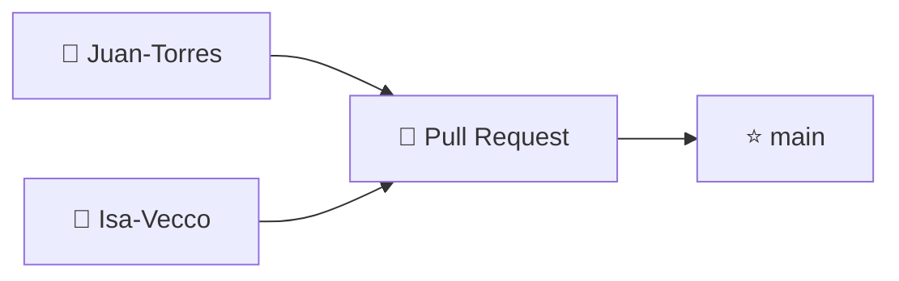

<p align="center">

# 🎓 Sistema Integral de Gestión de Asistencia Escolar

> 🖥️ App de escritorio + 🔌 API REST + 📱 App móvil para digitalizar el control de asistencia. Proyecto académico EEST (EACP).


</p>

## 📑 Índice

- [1. Descripción del proyecto](#1-descripción-del-proyecto)
- [2. Problemática](#2-problemática)
- [3. Alcance y funcionalidades](#3-alcance-y-funcionalidades)
- [4. Usuarios y roles](#4-usuarios-y-roles)
- [5. Tecnologías y arquitectura](#5-tecnologías-y-arquitectura)
- [6. Estructura del proyecto](#6-estructura-del-proyecto)
- [7. Requisitos previos](#7-requisitos-previos)
- [8. Instalación y configuración](#8-instalación-y-configuración)        
- [9. Uso del sistema](#9-uso-del-sistema)
- [10. Metas y factores críticos de éxito](#10-metas-y-factores-críticos-de-éxito)
- [11. Cronograma](#11-cronograma)
- [12. Costos](#12-costos)
- [13. Roadmap](#13-roadmap)
- [14. Equipo y contexto académico](#14-equipo-y-contexto-académico)
- [15. Licencia](#15-licencia)
- [16. Flujo de trabajo Git](#16-flujo-de-trabajo-git)
- [17. Documentación adicional](#17-documentación-adicional)

## 1. Descripción del proyecto

🏫 Actualmente el control de asistencia en la institución se realiza mayormente **en papel** 📝, lo que genera desorganización, riesgo de pérdida de datos, errores humanos y demora en los reportes.

✨ Este proyecto desarrolla un **sistema integral de gestión de asistencia escolar** compuesto por:

| Módulo | Carpeta | Descripción |
|---|---|---|
| 🖥️ **Aplicativo de escritorio** | `.net/` | Gestión institucional: alumnos, profesores, preceptores, cursos, materias, dictados, inscripciones y usuarios |
| 🔌 **API REST** | `Api/` | Expone los datos a la app, emite eventos en tiempo real (SSE) y gestiona clases con token QR |
| 📱 **App móvil** | `App/` | Registro de asistencia desde el celular (escaneo QR o código corto) |

🎯 **Objetivo:** digitalizar el registro diario, mejorar la disponibilidad de la información y automatizar reportes en una plataforma segura y organizada.

## 2. Problemática

**😞 Puntos débiles del sistema actual:**
- 📝 Registro en papel, con riesgo de pérdida y deterioro
- 🔍 Dificultad para consultar historial de asistencias
- 🐌 Procesos administrativos lentos
- ✍️ Errores en la carga manual de datos
- 📊 Sin validaciones automáticas ni reportes inmediatos
- 🗂️ Dependencia total de documentación física

**💪 Puntos fuertes que se conservan:**
- 🧑‍🏫 Experiencia de preceptores y docentes en la toma de asistencia
- 🏛️ Estructura organizacional claramente definida
- 📏 Reglas institucionales de asistencia/inasistencias ya conocidas
- 🧱 Metodología de trabajo establecida como base del nuevo sistema

## 3. Alcance y funcionalidades

### 🖥️ Escritorio (WinForms)

| Módulo | Descripción |
|---|---|
| 🔐 Autenticación | Login de usuarios con control de sesión |
| 🆕 Primer usuario | Creación del primer Administrador si no existen usuarios |
| 👥 Usuarios y perfiles | Alta, baja, modificación y activación/desactivación |
| 🎒 Alumnos | ABM completo de alumnos |
| 👨‍🏫 Profesores | ABM completo de profesores |
| 📋 Preceptores | ABM completo (contraseña bcrypt compatible con la API) |
| 🏫 Cursos / Especialidades | Administración de cursos y especialidades |
| 📚 Materias | ABM con asignación de especialidad |
| 🗓️ Dictados | Gestión de dictados (materia + profesor + preceptor) |
| ✏️ Inscripciones | Inscripción de alumnos a dictados |
| 🛡️ Permisos | Control de acceso según rol (menú filtrado en `FrmPrincipal`) |

### 🔌 API (`Api/`, puerto `3000`)

| Endpoint | Descripción |
|---|---|
| `GET /api/health` | 💚 Verifica que el servidor responde |
| `GET /api/alumnos` | 🎒 Lista alumnos (MySQL) |
| `POST /api/login` | 🔐 Autenticación por rol: preceptor, profesor o alumno |
| `GET /api/dictados` (+ `/:id/alumnos`, `/alumno/:idAlumno`) | 🗓️ Dictados e inscriptos |
| `GET /api/asistencia` · `POST /api/asistencia` · `POST /api/asistencia/lote` | ✅ Consulta y alta de asistencias |
| `GET /api/clases?fecha=` · `POST /api/clases` · `PATCH /api/clases/:id` | 🏫 Apertura y estados de clase |
| `POST /api/clases/:id/token` · `.../escanear` · `POST /api/clases/ingresar` | 📷 Token QR, escaneo y código corto |
| `GET /api/eventos` | 📡 Eventos en tiempo real (SSE, autenticado) |

### 📱 App móvil (`App/`)

| Pantalla | Rol |
|---|---|
| 📋 `PreceptorPrincipal` | Preceptor: clases y asistencia |
| 👨‍🏫 `ProfesorPrincipal` | Profesor: sus dictados y clases |
| 🎒 `AlumnoPrincipal` | Alumno: escaneo QR e ingreso con código |

## 4. Usuarios y roles

| Rol | Permisos |
|---|---|
| ⭐ **Administrador** | Configuración general, gestión de usuarios y mantenimiento (solo escritorio) |
| 🏛️ **Directivo** | Datos institucionales y consultas generales |
| 📋 **Preceptor** | Registro y seguimiento de asistencias (escritorio + app) |
| 👨‍🏫 **Profesor** | Carga de asistencia de sus clases (escritorio + app) |
| 🎒 **Alumno** | Registra su asistencia escaneando el QR (app) |

> El menú principal (`FrmPrincipal`) aplica permisos automáticamente: el módulo de usuarios solo es visible para el Administrador. El login de la API solo contempla preceptor, profesor y alumno (no hay rol administrador en la API).

## 5. Tecnologías y arquitectura

**🖥️ Escritorio (`.net/`):**
- 💬 **Lenguaje:** C# .NET Framework 4.7.2
- 🪟 **Interfaz:** Windows Forms + MaterialSkin.2
- 🗄️ **Base relacional:** MySQL `gestion_asistencia_eest`
- 🍃 **Base documental:** MongoDB Atlas (usuarios y autenticación del escritorio)
- 📦 **Drivers:** `MySql.Data` + `MongoDB.Driver` (+ `CryptSharpOfficial` **2.1.0.0** para bcrypt)
- 🧰 **IDE:** Visual Studio (workload .NET desktop development)
- 🧱 **Arquitectura:** en capas tipo MVC

**🔌 API (`Api/`):**
- 🟢 Node.js + Express 5, `mysql2`, `bcryptjs`, `cors`, `dotenv`
- Lee/escribe el mismo MySQL que el escritorio (única fuente de verdad compartida)

**📱 App (`App/`):**
- ⚛️ React Native con Expo SDK 57, React 19
- 📷 Cámara (`expo-camera`) para escaneo QR, eventos en tiempo real (SSE)

**🧱 Capas del escritorio:**

```text
Vista (Forms) <-> Controlador (lógica) <-> Modelo (Entidades + DAO + Conexión)
```

- 🧬 **Entidades:** `Alumno`, `Profesor`, `Preceptor`, `Materia`, `Especialidad`, `Dictado`, `Inscripcion`, `Asistencia`, `Usuario`, `Rol`
- 🗃️ **DAO:** `AlumnoDAO`, `ProfesorDAO`, `PreceptorDAO`, `MateriaDAO`, `EspecialidadDAO`, `DictadoDAO`, `InscripcionDAO` (MySQL) y `UsuarioDAO` (MongoDB)
- 🔌 **Conexion:** `conexionBD.cs` (MySQL), `ConexionMongo.cs` (Atlas)
- 🎮 **Controlador:** `Alumno`, `Profesor`, `Preceptor`, `Materia`, `Especialidad`, `Dictado`, `Inscripcion`, `Usuario`
- 🪟 **Vista:** `FrmLogin`, `FrmPrincipal`, `FrmInicio`, `FrmAlumnos`, `FrmProfesores`, `FrmPreceptores`, `FrmMaterias`, `FrmEspecialidades`, `FrmDictados`, `FrmInscripcion`, `FrmUsuarios`, `FrmPrimerUsuario`, `FrmConfiguracion`, `FrmConfirmarEliminar`
- 🧰 **Utilidades:** `Sesion`, `Configuracion`, `Logger` (logs en `bin/**/logs`), `DatosException`, `Ejecutor`

**🔑 Contraseñas:** las de preceptor/profesor en MySQL usan bcrypt (`$2a$`, costo 10), interoperable entre el escritorio (CryptSharp) y la API (bcryptjs).

> 🧭 Detalle de sincronización escritorio ↔ app y decisiones pendientes: ver [`PROPUESTA-SINCRONIZACION.md`](PROPUESTA-SINCRONIZACION.md).

## 6. Estructura del proyecto

```text
Sistema_Asistencia/
├── 📖 README.md
├── 🧩 LEEME_recomponer.md            # recomponer los 3 módulos desde un zip
├── 🔀 PROPUESTA-SINCRONIZACION.md    # conexión escritorio <-> app (fases)
├── 📄 ComoFuncionaElSistema.pdf/.html
├── 🖥️ .net/                          # módulo escritorio
│   ├── CHECKLIST-MEJORAS.md
│   ├── secreto.config             # 🔒 LOCAL, gitignored (URI Atlas ofuscado)
│   └── SistemaAsistencia/
│       ├── SistemaAsistencia.slnx
│       ├── BD/2026-09-24_baja_logica_activo.sql
│       └── SistemaAsistencia/
│           ├── Program.cs
│           ├── App.config         # MySQL local (MongoAtlas se completa por wizard)
│           ├── packages.config
│           ├── Controlador/
│           ├── Modelo/Conexion|DAO|Entidades/
│           ├── Vista/Login|Principal|Alumnos|Profesores|Preceptores|.../
│           └── Utilidades/
├── 🔌 Api/                           # módulo API (Node/Express)
│   ├── index.js
│   ├── .env.example               # plantilla (el .env real es 🔒 LOCAL)
│   ├── config/db.js
│   ├── rutas/asistencias|clases|dictados|eventos|login
│   ├── scripts/migrar_a_clases.sql|agregar_codigo_clase.sql|seed.js
│   └── utilidades/
└── 📱 App/                           # módulo móvil (Expo)
    ├── App.js
    ├── app.json
    ├── src/api.js
    └── src/pantallas/Alumno|Preceptor|ProfesorPrincipal
```

## 7. Requisitos previos

**🔧 Hardware:**
- 🖥️ PC con Windows 10+ (personal directivo / administrativo)
- 📱 Celular con Expo Go + PC en la misma red (app móvil)
- 🗄️ MySQL Server 8.x (local o remoto) + acceso a MongoDB Atlas

**💿 Software:**
- 🧰 Visual Studio 2022+ (workload .NET desktop development)
- 🏗️ .NET Framework 4.7.2 Developer Pack
- 🐬 MySQL Server 8.x + MySQL Workbench
- 🟢 Node.js 20+ (para `Api/` y `App/`)
- 📲 Expo Go en el celular (para `App/`)

## 8. Instalación y configuración

### 🖥️ 8.1 Escritorio (.NET)

1. **Clonar el repositorio** en tu branch de trabajo (ver [§16](#16-flujo-de-trabajo-git)):
   ```bash
   git clone -b Juan-Torres https://github.com/JuanI19T/Sistema_Asistencia.git
   ```

2. **Abrir la solución:** `.net/SistemaAsistencia/SistemaAsistencia.slnx` en Visual Studio.

3. **Restaurar paquetes NuGet** (VS lo hace automático; si no: clic derecho en la solución → *Restaurar paquetes NuGet*). Incluye `MySql.Data`, `MongoDB.Driver`, `MaterialSkin.2` y `CryptSharpOfficial` (**2.1.0.0**, fijo en `packages.config`).

4. **Configurar MySQL local:** revisar la cadena `MySQL` en `SistemaAsistencia/App.config` (apunta a localhost por defecto).

5. **Compilar y ejecutar (F5):**
   - 🧙 La primera vez se abre `FrmConfiguracion`: pegar el URI completo de MongoDB Atlas (empieza con `mongodb+srv://`). Se guarda ofuscado en `.net/secreto.config` (🔒 local, no se commitea).
   - 🆕 Si no existen usuarios, se abre `FrmPrimerUsuario` para crear el primer Administrador.
   - 🔐 Luego se accede con `FrmLogin`.

> ⚠️ Compilar con el MSBuild de Visual Studio. `dotnet build` no es compatible con este proyecto clásico de .NET Framework.

### 🗄️ 8.2 Base de datos MySQL

1. Crear la base `gestion_asistencia_eest` y aplicar (⚠️ borra datos anteriores):
   ```bash
   mysql -u usuario -p gestion_asistencia_eest < Api/scripts/migrar_a_clases.sql
   ```
2. Script adicional del escritorio (baja lógica): `.net/SistemaAsistencia/BD/2026-09-24_baja_logica_activo.sql`
3. Cargar datos de prueba (idempotente; contraseña inicial = DNI):
   ```bash
   cd Api
   node scripts/seed.js
   ```

### 🔌 8.3 API (Node)

1. Crear el `.env` y completar con tu MySQL:
   ```bash
   cd Api
   copy .env.example .env
   npm install
   ```
2. Levantar la API:
   ```bash
   node index.js
   ```
   💚 Queda en `http://localhost:3000` (`GET /api/health` para verificar).

### 📱 8.4 App móvil (Expo)

1. Instalar dependencias e iniciar:
   ```bash
   cd App
   npm install
   npx expo start
   ```
2. 📲 Escanear el QR con **Expo Go** (misma WiFi que la PC; la app resuelve la IP automáticamente).

## 9. Uso del sistema

**🖥️ Escritorio:**
1. ▶️ Iniciar la app, crear el primer Administrador si es la primera vez.
2. 🔐 Iniciar sesión con usuario y contraseña.
3. 🧭 Desde el menú principal:
   - ⭐ **Administrador:** usuarios, alumnos, profesores, preceptores y materias.
   - 🏛️ **Directivo:** datos institucionales y consultas.
   - 📋 **Profesor / Preceptor:** dictados, inscripciones y datos.
4. 👤 La sesión muestra nombre y rol en `FrmPrincipal`. Los errores de arranque quedan en `bin/**/logs/log_*.txt`.

**🔌📱 API + App:**
1. Levantar MySQL y la API (`node index.js`).
2. El profesor/preceptor abre su clase desde la app (la API genera el token QR).
3. El alumno escanea el QR (o ingresa el código corto) y su asistencia se registra en tiempo real. ⚡

**🧪 Datos de prueba (seed, contraseña = DNI):**

| Rol | Nombre | DNI |
|---|---|---|
| 👨‍🏫 Profesor | Carlos Gutierrez | `30111222` |
| 👩‍🏫 Profesora | María Fernández | `31222333` |
| 📋 Preceptora | Laura Martínez | `34555666` |
| 🎒 Alumno | Juan Pérez | `45222001` |
| 🎒 Alumna | Ana Gómez | `45222002` |
| 🎒 Alumno | Luis Díaz | `45222003` |

## 10. Metas y factores críticos de éxito

**🎯 Metas:**
- ✅ Digitalizar 100% el control de asistencia
- 📉 Reducir el uso de papel
- 📡 Mejorar disponibilidad de la información
- 🗂️ Facilitar administración de alumnos, profesores y cursos
- 🤖 Automatizar reportes de asistencia

**🔑 Factores críticos:**
- 🔐 Autenticación segura y funcional
- 🛡️ Permisos correctos por rol
- 🟢 Disponibilidad permanente de la BD
- ✨ Interfaz simple e intuitiva
- ⚡ Registro rápido de asistencias
- 🧱 Integridad y seguridad de los datos
- 🔌 Código extensible (API + app)

## 11. Cronograma

| Etapa | Período estimado |
|---|---|
| 🔍 Estudio de factibilidad | 29 de abril – primera semana |
| 📝 Análisis de requisitos | Mayo |
| 🎨 Diseño del sistema | Junio – Julio |
| 💻 Desarrollo de la aplicación | Agosto – Octubre |
| 🧪 Implementación y pruebas | Noviembre |
| 🎓 Presentación EACP | Fin del ciclo lectivo |

**⏳ Tiempo total:** ~7 meses.

## 12. Costos

💰 Proyecto académico sin costo de mano de obra.

| Concepto | Costo estimado |
|---|---|
| 💻 Desarrollo de software | Sin costo (proyecto académico) |
| 🐬 MySQL Community Edition | $0 |
| 🧰 Visual Studio Community | $0 |
| 🟢 Node.js / Express / Expo | $0 |
| 🖥️ Equipamiento existente | Sin costo adicional |
| 🧑‍🏫 Capacitación de usuarios | Mínima |
| 🛠️ Mantenimiento anual | Bajo |

El principal costo futuro será el mantenimiento correctivo y evolutivo.

## 13. Roadmap

**✅ Hecho:**
- [x] 🔐 Login y primer usuario admin (escritorio)
- [x] 🗂️ ABM Alumnos, Profesores, Preceptores, Materias, Especialidades, Dictados, Inscripciones, Usuarios
- [x] 🛡️ Permisos por rol
- [x] 🗑️ Baja lógica (`activo`) + script SQL
- [x] 🔒 Credenciales Mongo en `secreto.config` (ofuscado, gitignored)
- [x] 🔌 API REST: login, dictados, asistencias, clases con QR, health
- [x] 📡 SSE API → app en tiempo real
- [x] 📱 App móvil con 3 roles + QR + código corto

**🚧 Pendiente:**
- [ ] 🔄 Refresco automático en la app ante cambios del escritorio (outbox + triggers, propuesta Fase 2)
- [ ] 🔗 Unificar joins de dictados (INNER vs LEFT) entre escritorio y API
- [ ] 🗑️ Filtrar `activo` en todos los listados de la API
- [ ] 📋 Exponer `id_preceptor` en `GET /api/dictados`
- [ ] ✏️ Endpoints de escritura para dictados (`POST`, `PATCH`)
- [ ] ⭐ Rol administrador en la API / unificar identidad
- [ ] 💾 Backup/restauración de MySQL y Mongo
- [ ] 🚫 Bloqueo por intentos fallidos, auditoría, tests

## 14. Equipo y contexto académico

🎓 Proyecto escolar desarrollado como Evaluación Anual de Capacidades Profesionales (EACP). Migrado desde carpeta compartida de Drive a GitHub para control de versiones y trabajo colaborativo.

| Integrante | Branch de trabajo |
|---|---|
| 👨‍💻 Juan Torres | [`Juan-Torres`](https://github.com/JuanI19T/Sistema_Asistencia/tree/Juan-Torres) |
| 👩‍💻 Isa Vecco | [`Isa-Vecco`](https://github.com/JuanI19T/Sistema_Asistencia/tree/Isa-Vecco) |

## 15. Licencia

📜 Proyecto académico sin licencia definida por el momento.

## 16. Flujo de trabajo Git



**Reglas:**

1. 🌿 Cada uno trabaja **solo en su branch**: `Juan-Torres` e `Isa-Vecco`. Nunca en `main` ni en la del otro.
2. 🔀 Todo cambio llega a `main` **únicamente vía Pull Request**, previa revisión y aprobación del otro. **Nunca** commit/push/merge directo a `main`.
3. 🔄 Para traer lo último de `main` a tu branch: `git fetch origin` + `git merge origin/main` (nunca al revés).
4. 🔒 No commitear secretos ni generados: `secreto.config`, `Api/.env`, `*.zip`, `node_modules/`, `.expo/`, `bin/`, `obj/`, `.vs/`, `packages/` (ver `.gitignore`).

> 🛡️ Recomendado: activar branch protection en `main` (requiere PR + prohíbe pushes directos) para que la regla 2 se cumpla sola.

## 17. Documentación adicional

| Documento | Contenido |
|---|---|
| 📄 `ComoFuncionaElSistema.pdf` / `.html` | Descripción funcional del sistema |
| 🔀 `PROPUESTA-SINCRONIZACION.md` | Conexión escritorio ↔ app, problemas y hoja de ruta por fases |
| 🧩 `LEEME_recomponer.md` | Recomponer los 3 módulos desde un zip |
| ✅ `.net/CHECKLIST-MEJORAS.md` | Checklist de mejoras del escritorio con estados |

---

<p align="center">Hecho con 💚 para la EEST · EACP 2026</p>
