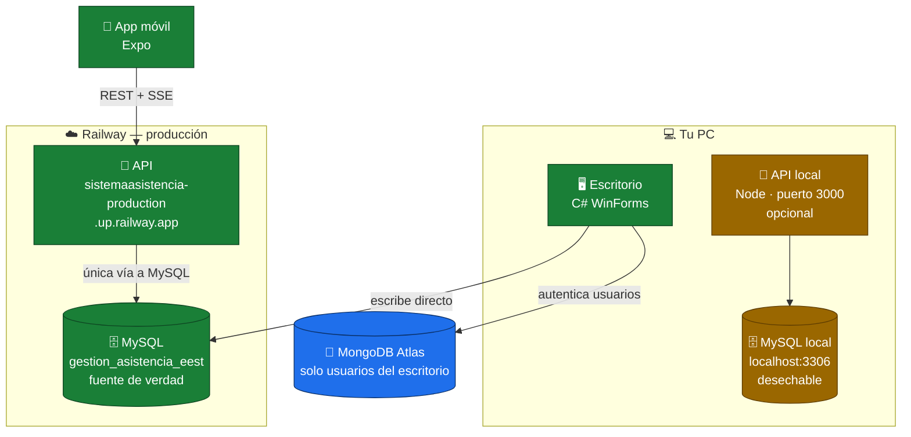

# context.md — Contexto del proyecto

> Guía rápida para entender el proyecto antes de tocar código.
> Documento hermano: [`README.md`](README.md) (visión general para humanos).
> Reglas de trabajo del agente: [`AGENTS.md`](AGENTS.md).

## 📑 Índice

| | Sección | Qué_findrás |
|---|---|---|
| [1](#s1) | [¿Qué es?](#s1) | El proyecto en dos líneas |
| [2](#s2) | [Los tres módulos](#s2) | Diagrama con Railway incluido |
| [3](#s3) | [Base de datos](#s3) | Script definitivo y cómo restaurarlo |
| [4](#s4) | [Arquitectura del escritorio](#s4) | Las capas y los Forms reales |
| [5](#s5) | [Cómo levantar cada módulo](#s5) | Pasos exactos, incluido `credenciales.env` |
| [6](#s6) | [Cuentas de prueba](#s6) | Los 6 usuarios del script |
| [7](#s7) | [Flujo de negocio](#s7) | Qué pasa en una clase |
| [8](#s8) | [Limitación conocida](#s8) | Por qué la app no ve al escritorio en vivo |
| [9](#s9) | [Reglas y convenciones](#s9) | Lo que no se toca y por qué |
| [10](#s10) | [Mapa de archivos](#s10) | Dónde está cada cosa |
| [11](#s11) | [Base de datos: cuál es cuál](#s11) | 🔴 La confusión más común del proyecto |

**Leyenda:** 🔴 riesgo o prohibido · 🟡 pendiente o con salvedad · 🟢 seguro u opcional

---

<a id="s1"></a>

## 1. ¿Qué es? 🎯

Sistema integral de gestión de asistencia escolar para una EEST (proyecto académico, EACP).
Reemplaza el registro en papel por: un aplicativo de escritorio para la administración, una API
intermedia y una app móvil para registrar asistencia en el aula (QR / código corto).

<a id="s2"></a>

## 2. Los tres módulos 🧩

| Módulo | Carpeta | Stack | Rol |
|---|---|---|---|
| 🖥️ **Escritorio** | `Escritorio/SistemaAsistencia/` | C# .NET Framework 4.7.2, WinForms, MaterialSkin | ABMs institucionales (alumnos, profesores, preceptores, materias, especialidades, dictados, inscripciones, usuarios). Escribe **directo a MySQL**. Autentica usuarios propios contra **MongoDB Atlas** |
| 🔌 **API** | `Api/` | Node.js, Express 5, mysql2, bcryptjs | Único acceso a MySQL de la app. Endpoints REST + **SSE** (`/api/eventos`). Login por rol con `dni` + bcrypt, token Bearer |
| 📱 **App móvil** | `App/` | React Native + Expo 57 (Expo Go) | Login y pantallas por rol. Escaneo QR (`expo-camera`), SSE con reconexión automática. **Habla solo con la API**, nunca directo a la BD |



- 🟢 MySQL `gestion_asistencia_eest` en Railway es la **única fuente de verdad compartida**.
- 🟡 La app obtiene la IP del host sola (`App/src/api.js`, `Constants.expoConfig.hostUri`). La API escucha en el **puerto 3000**.
- 🔴 El escritorio **no tiene integración HTTP**: sus cambios no generan eventos SSE (ver [§8](#s8)).

<a id="s3"></a>

## 3. Base de datos (MySQL) 🗄️

**Script definitivo:**
`Escritorio/SistemaAsistencia/BD/2026-09-26_reconstruccion_definitiva.sql`

Reconstruye todo el esquema, **borra los datos previos** e incluye catálogo y datos de prueba.

**Tablas:** `especialidad`, `materia`, `profesor`, `preceptor`, `alumno`, `dictado`, `inscribe`,
`clase`, `asistencia`, `usuario`.

**Alcance de un dictado 🔴** · `dictado` lleva `division` y `grupo`, y **ambos admiten NULL**.
No hay tabla `curso`: el alumno no pertenece a un curso, solo cursa materias de un año, así que
división y grupo son etiquetas **del dictado**, no del alumno.

| `division` | `grupo` | Significa |
|---|---|---|
| `NULL` | `NULL` | **Todo el curso** (materia que se da al curso entero) |
| `5` | `NULL` | Toda la división 5 |
| `5` | `2` | División 5, grupo 2 |

Rangos reales por ciclo: **Ciclo Básico** (años 1-3) división 1-7; **Tecnicaturas**
(años 4-7) división 1-6. **Grupo 1-2 en todos los casos** (0/`NULL` = ambos grupos).
Los `CHECK` de MySQL solo acotan el máximo global, porque
un `CHECK` no puede leer `materia.anio_materia` de otra tabla: la regla fina por ciclo se valida
en `FrmDictados.AlcanceValido()` y en `DictadoController.Validar()`.
En la UI el `0` representa el `NULL` ("todo el curso").

**Restaurar** (desde la raíz del repo):

```bash
mysql -u usuario -p < Escritorio/SistemaAsistencia/BD/2026-09-26_reconstruccion_definitiva.sql
```

<a id="s4"></a>

## 4. Arquitectura del escritorio (MVC en capas) 🏛️

Raíz del proyecto: `Escritorio/SistemaAsistencia/SistemaAsistencia/`

| Capa | Contenido |
|---|---|
| `Vista/` | Forms: `FrmLogin`, `FrmPrincipal`, `FrmInicio`, `FrmAlumnos`, `FrmProfesores`, `FrmPreceptores`, `FrmMaterias`, `FrmEspecialidades`, `FrmDictados`, `FrmInscripcion`, `FrmUsuarios`, `FrmPrimerUsuario`, `FrmConfirmarEliminar` + helpers `UIHelper.cs` y `CtrlTelefono.cs` |
| `Controlador/` | Un `*Controller` por módulo |
| `Modelo/Entidades/` + `Modelo/DAO/` | Un DAO por tabla; MySQL para los datos, MongoDB para los usuarios |
| `Modelo/Conexion/` | `conexionBD.cs` (MySQL), `ConexionMongo.cs` (Atlas), `Credenciales.cs` (lee el `.env`) |
| `Utilidades/` | `Sesion.cs` (usuario actual en memoria), `Logger.cs` (errores a `bin/**/logs/`), `Ejecutor.cs`, `DatosException.cs`, `Tema.cs`, `TelefonoHelper.cs` |

> 📌 **Regla inviolable: no romper el MVC.** Toda futura integración HTTP debe vivir solo en la
> capa Modelo (DAO/repositorio). Nunca en Vistas ni Controladores.

<a id="s5"></a>

## 5. Cómo levantar cada módulo 🚀

Orden sugerido: **BD → API → App**. El escritorio es independiente de los otros dos.

### Paso 0 — Credenciales del escritorio (obligatorio) 🔴

El escritorio **no arranca sin** `credenciales.env`. No está en git, hay que crearlo una vez por máquina:

```bash
cd Escritorio/SistemaAsistencia/SistemaAsistencia
copy credenciales.env.example credenciales.env
```

Editá `credenciales.env` con tus cadenas reales. El formato tiene que ser exacto:

```
MYSQL=Server=<host>;Port=<puerto>;Database=gestion_asistencia_eest;Uid=<user>;Pwd=<password>;
MONGO=mongodb+srv://<user>:<password>@<cluster>.mongodb.net/
```

> 🔴 **Nunca** pongas las cadenas reales en `App.config` ni en ningún archivo versionado.
> `App.config` conserva solo placeholders como respaldo.

### 1 — Base de datos 🟢

Restaurar el script definitivo ([§3](#s3)).

### 2 — API 🔌

```bash
cd Api
copy .env.example .env     # y completá los valores
npm install
npm start                  # o: npm run dev  (con watch)
```

Queda escuchando en `http://localhost:3000`.

> 🟡 **`SESSION_SECRET`**: si no la definís, la API genera una clave aleatoria en cada arranque y
> **todos los tokens emitidos quedan inválidos**. En Railway, cada redeploy sin esa variable
> desloguea a todo el mundo.

> 🟡 **En Railway** el `DB_HOST` va con el host de la **red privada**, no el proxy TCP público.

### 3 — App móvil 📱

```bash
cd App
npm install
npx expo start
```

Escaneá el QR con **Expo Go**. Requisito: PC y celular en la **misma red Wi-Fi**
(o usá los scripts `*-usb` del `package.json` para trabajar por cable).

> 🟡 Para apuntar la app a una API desplegada en vez de la local, definí
> `EXPO_PUBLIC_API_URL` en `App/.env` **con el prefijo `https://` incluido**.
> Ese archivo está gitignored y solo debe contener URLs públicas, nunca secretos.

### 4 — Escritorio 🖥️

Abrí `Escritorio/SistemaAsistencia/SistemaAsistencia.slnx` en Visual Studio, restaurá NuGet y F5.

> 🔴 **Build por consola**: usá el **MSBuild de Visual Studio 18**
> (`C:\Program Files\Microsoft Visual Studio\18\Community\MSBuild\Current\Bin\MSBuild.exe`).
> `dotnet msbuild` **falla** con MSB3822/3823 en este proyecto clásico de .NET Framework.

### 5 — Debug de API + App 🟢

`.vscode/launch.json` trae configs compuestas para debug de API + App: **"Api + App (Internet)"**
y **"Api + App (LAN - USB)"**. También hay launches separados (`API: Node.js`, `App: Expo LAN`,
`App: Expo QR`).

<a id="s6"></a>

## 6. Cuentas de prueba 🧪

Contraseña = DNI en todos los casos. En personal el legajo es igual al DNI; en alumnos lo genera la escuela.

| Rol | Nombre | DNI | Legajo |
|---|---|---|---|
| 👨‍🏫 Profesor | Carlos Gutierrez | `30111222` | `30111222` |
| 👩‍🏫 Profesora | María Fernández | `31222333` | `31222333` |
| 📋 Preceptora | Laura Martínez | `34555666` | `34555666` |
| 🎒 Alumno | Juan Pérez | `45222001` | `1001` |
| 🎒 Alumna | Ana Gómez | `45222002` | `1002` |
| 🎒 Alumno | Luis Díaz | `45222003` | `1003` |

La app muestra botones de login rápido con estas cuentas **solo en `__DEV__`** (`App/App.js`).

<a id="s7"></a>

## 7. Flujo de negocio (asistencia en el aula) 📋

1. El **profesor** abre una clase desde su dictado (`POST /api/clases`) y se generan QR + código corto.
2. Los **alumnos** marcan presencia escaneando el QR (`POST /api/clases/:id/escanear`) o ingresando el código (`POST /api/clases/ingresar`).
3. El **preceptor** ve la asistencia en vivo por SSE y puede corregirla.

**Endpoints principales** (el índice completo está en `GET /` de la API):
`/api/login` · `/api/dictados*` · `/api/clases*` · `/api/asistencia*` · `/api/eventos` (SSE con Bearer).

<a id="s8"></a>

## 8. Limitación conocida 🟡

> Esta sección describe un problema **abierto**. No tiene solución implementada.

El escritorio escribe **directo en MySQL**. La API emite eventos SSE **solo** por los cambios que
ella misma hace. Por lo tanto:

- Un cambio hecho **en el escritorio** (por ejemplo reasignar el preceptor de un dictado) **no llega** a la app.
- La app se entera recién cuando vuelve a consultar el endpoint.
- Y al revés: un cambio hecho **en la app** tampoco refresca las pantallas del escritorio.

En resumen: **el escritorio y la app comparten la base, pero no se avisan entre sí.**

<a id="s9"></a>

## 9. Reglas y convenciones 📌

### Git 🌿

- Trabajá en tu rama (`Juan-Torres`, `Isa-Vecco`). **PR obligatorio a `main`**, nunca commitees directo a `main`.
- Nunca commitees ni pushees en la rama de la otra persona: frená y preguntá.
- Ramas existentes: `main`, `Juan-Torres`, `Isa-Vecco`.
- Cada máquina define su usuario con `git config user.name`, que determina a qué rama pertenecés:

| `user.name` | Rama |
|---|---|
| `JuanI19T` | `Juan-Torres` |
| `isabellacarrete` | `Isa-Vecco` |

**Cómo sincronizar con `main`:** pedile al agente *"traeme los cambios de main"* en el chat. No hay
ningún comando que ejecutar. Las reglas operativas de Git —qué se puede y qué no hacer, cómo traer
`origin/main` en vez de `main`, cómo manejar conflictos— están en [`AGENTS.md`](AGENTS.md), que el
agente carga siempre.

### Credenciales 🔴

> 🔴 **Las credenciales NO se hardcodean.** Esta regla antes decía lo contrario y por eso las
> cadenas de MySQL y MongoDB estuvieron versionadas en el historial. Ya fueron rotadas; no repitas el error.

| Módulo | Dónde van las credenciales | ¿Versionado? |
|---|---|---|
| 🖥️ Escritorio | `credenciales.env` (ignorado por git) | 🟢 No |
| 🖥️ Escritorio | `App.config` → solo placeholders | 🟢 Sí, vacío |
| 🔌 API | `Api/.env` (ignorado por git) | 🟢 No |
| 🔌 API | `Api/.env.example` → solo placeholders | 🟢 Sí, vacío |

Nunca copies una cadena real a ningún archivo versionado. Si tocás una credencial, **rotala** en el
proveedor (Atlas / Railway), no solo en el código.

**Nunca versionar:** `.env` · `credenciales.env` · `*.pem` · `*.key` · `*.zip`

### Nombres de tabla 🔴

> 🔴 **Siempre en minúscula.** Railway corre **Linux**, donde `ALUMNO` y `alumno` son tablas distintas.
> En Windows funcionan igual, así que el error aparece únicamente en producción.

Por eso el escritorio normalizó sus queries (`FROM alumno`, no `FROM ALUMNO`).

### Contraseñas 🔑

- `contrasena` se hashea con **bcrypt coste 10** (prefijo `$2a$` al hashear el escritorio, `$2b$` en los
  hashes sembrados por el script SQL). bcryptjs y CryptSharp verifican ambos prefijos.
- bcryptjs (API) y CryptSharp (escritorio) son interoperables.
- 🔴 **No usar `BCrypt.Net-Next`**: es delay-signed y no carga en .NET Framework. Usá `CryptSharpOfficial`.
- El login del escritorio contra MongoDB usa **PBKDF2 propio** (`pbkdf2$`, 10k iteraciones): es una identidad
  separada de la de la API. 🟡 Pendiente de unificar.

### Otros

- **Expo**: la app usa SDK 57. Leé la documentación versionada
  (<https://docs.expo.dev/versions/v57.0.0/>) antes de escribir código de la app.
- **Estilo**: identificadores y BD en español (`alumno`, `dictado`, `obtenerDictados`).
  En la API, rutas y JSON **sin acentos**.
- **Baja lógica**: las entidades tienen columna `activo`. El login de la API filtra `activo = 1`;
  🟡 faltó aplicarlo en otros listados.

<a id="s10"></a>

## 10. Mapa de archivos clave 🗺️

| Archivo / Carpeta | Qué es |
|---|---|
| `Api/index.js` | Bootstrap de la API + índice de endpoints |
| `Api/config/db.js` | Pool de mysql2 (lee `.env`) |
| `Api/rutas/` | `login.js` · `dictados.js` · `clases.js` · `asistencias.js` · `eventos.js` (SSE) |
| `Api/utilidades/autenticacion.js` | Emisión y verificación del token (Bearer) |
| `Api/utilidades/eventos.js` | Bus de eventos SSE en memoria |
| `Api/utilidades/asistencia.js` | Validaciones del módulo de asistencia |
| `Api/utilidades/alcance.js` | Texto del alcance de un dictado (división/grupo/`NULL`) |
| `App/src/alcance.js` | Idem en la app, con fallback si la API es vieja |
| `Api/.env.example` | Plantilla de configuración de la API |
| `App/App.js` | Login + enrutado por rol |
| `App/src/api.js` | Cliente HTTP/SSE (detecta host, guarda el token) |
| `App/src/pantallas/` | `ProfesorPrincipal.js` · `PreceptorPrincipal.js` · `AlumnoPrincipal.js` |
| `Escritorio/.../SistemaAsistencia.slnx` | Solución del escritorio (abrir en Visual Studio) |
| `Escritorio/.../Modelo/Conexion/Credenciales.cs` | Lee el `.env` del escritorio (versionado, sin secretos) |
| `Escritorio/.../credenciales.env.example` | Plantilla de credenciales del escritorio |
| `Escritorio/SistemaAsistencia/BD/` | Script SQL definitivo de reconstrucción |
| `.vscode/launch.json` | Debug de API + App en un F5 |

<a id="s11"></a>

## 11. Base de datos: cuál es cuál 🔴

> 🔴 La confusión más común del proyecto. Hay **más de un destino** posible en `DB_HOST` y
> apuntan a bases **distintas**. Antes de probar nada, confirmá cuál estás usando.

| Destino | Host | Qué contiene | Quién lo usa |
|---|---|---|---|
| 🟢 **Producción** | host de la red privada de Railway | **Los datos reales** | API en Railway, y el escritorio |
| 🟢 **Producción (vía externa)** | `iriguchi.proxy.rlwy.net:23138` | La **misma** base de producción | El escritorio, desde tu PC |
| 🟡 **Local** | `localhost:3306` | Una base **desechable y separada** | Solo la API local |

**La API local apunta a `localhost:3306`**, es decir a una base distinta de la de producción. Eso es
intencional y sirve para:

- 🟢 probar migraciones o restaurar el script definitivo, que **borra los datos**, sin tocar producción
- 🟡 probar el flujo de asistencia sin que nada de lo que hagas afecte los datos reales

🔴 **Lo que NO te da:** datos reales. Si probás contra la API local y algo falla, el error no es
necesariamente el mismo que vas a ver en producción. Y al revés: si algo funciona en local, no
garantiza que funcione en Railway.

> 📌 ¿Querés que la API local trabaje contra producción? Cambiá `DB_HOST` y `DB_PORT` en
> `Api/.env` por los del proxy TCP. Recordá que el bus de eventos SSE es **por proceso**: si el
> profesor y el preceptor apuntan a instancias distintas, no se ven en tiempo real.
